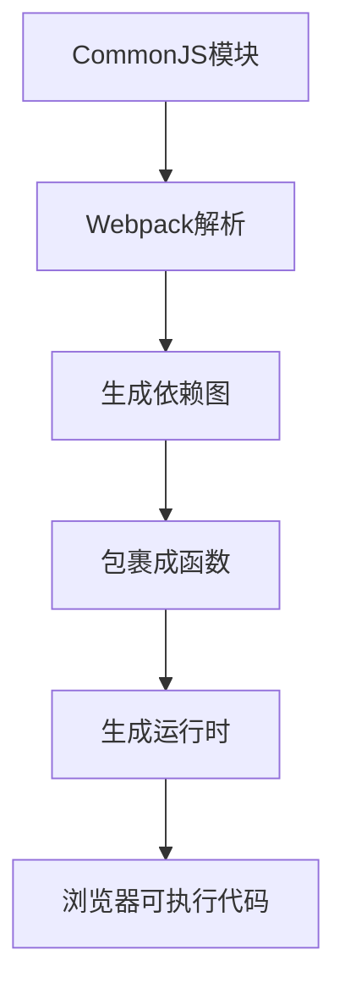

# Webpack 如何让浏览器支持 CommonJS 规范

## 开场白

"关于 Webpack 如何实现让浏览器支持 CommonJS 规范的问题，这涉及到模块化方案的转换原理。让我结合五年工程化经验，从底层机制到实际实现为您详细解析。"

## 一、核心原理

### 1. 模块化转换流程



### 2. 关键实现机制

```javascript
// @环境: Webpack打包后的代码结构
// 原始CommonJS模块
// math.js
const add = (a, b) => a + b;
module.exports = { add };

// app.js
const { add } = require('./math');
console.log(add(2, 3));

// Webpack转换后（简化版）
(function(modules) {
    // 1. 实现require函数
    function __webpack_require__(moduleId) {
        // 缓存检查
        if (installedModules[moduleId]) {
            return installedModules[moduleId].exports;
        }
        
        // 2. 创建新模块
        var module = installedModules[moduleId] = {
            exports: {}
        };
        
        // 3. 执行模块函数
        modules[moduleId].call(
            module.exports,
            module,
            module.exports,
            __webpack_require__
        );
        
        return module.exports;
    }
    
    // 4. 入口模块启动
    return __webpack_require__("./src/app.js");
})({
    "./src/math.js": function(module, exports) {
        const add = (a, b) => a + b;
        module.exports = { add };
    },
    
    "./src/app.js": function(module, exports, __webpack_require__) {
        const { add } = __webpack_require__("./src/math.js");
        console.log(add(2, 3));
    }
});
```

## 二、关键技术点

### 1. 模块包裹机制

```javascript
// Webpack的模块包裹模板
function(module, exports, __webpack_require__) {
    // 原始模块代码会被转换后放在这里
    eval("原始代码转换后的字符串");
}
```

### 2. 依赖图分析

```javascript
// webpack.config.js
module.exports = {
    entry: './src/app.js', // 从入口开始分析依赖
    // ...
};

// 生成的依赖关系
{
    "modules": [
        {
            "id": "./src/math.js",
            "dependencies": []
        },
        {
            "id": "./src/app.js",
            "dependencies": ["./src/math.js"]
        }
    ]
}
```

### 3. 运行时注入

```javascript
// Webpack自动注入的运行时
__webpack_require__.r = (exports) => {
    Object.defineProperty(exports, '__esModule', { value: true });
};

__webpack_require__.d = (exports, definition) => {
    for (var key in definition) {
        Object.defineProperty(exports, key, {
            enumerable: true,
            get: definition[key]
        });
    }
};
```

## 三、完整示例演示

### 1. 项目结构

```
project/
├── src/
│   ├── math.js
│   └── app.js
├── webpack.config.js
└── index.html
```

### 2. 源代码示例

```javascript
// math.js
const PI = 3.1415926;

function circleArea(r) {
    return PI * r * r;
}

module.exports = {
    circleArea
};

// app.js
const { circleArea } = require('./math');

console.log('Area:', circleArea(5));
```

### 3. Webpack 配置

```javascript
// webpack.config.js
const path = require('path');

module.exports = {
    entry: './src/app.js',
    output: {
        filename: 'bundle.js',
        path: path.resolve(__dirname, 'dist')
    },
    mode: 'development'
};
```

### 4. 打包结果分析

```javascript
// dist/bundle.js (简化版)
(() => {
    var __webpack_modules__ = {
        "./src/math.js": (module) => {
            const PI = 3.1415926;
            function circleArea(r) {
                return PI * r * r;
            }
            module.exports = { circleArea };
        },
        
        "./src/app.js": (module, __unused_webpack_exports, __webpack_require__) => {
            const { circleArea } = __webpack_require__("./src/math.js");
            console.log('Area:', circleArea(5));
        }
    };
    
    var __webpack_exports__ = {};
    __webpack_require__("./src/app.js");
})();
```

### 5. 浏览器运行

```html
<!-- index.html -->
<!DOCTYPE html>
<html>
<head>
    <title>Webpack CommonJS Demo</title>
</head>
<body>
    <script src="dist/bundle.js"></script>
</body>
</html>
```

## 四、关键问题解答

### 1. 如何解决 `module` 和 `exports`？

"Webpack 通过包裹函数参数提供这两个变量：

```javascript
function(module, exports) {
    // 原始代码中的 module.exports 会被替换
    module.exports = { /*...*/ };
}
```

### 2. 如何处理循环依赖？

"通过缓存机制解决：

```javascript
function __webpack_require__(moduleId) {
    // 已加载模块直接返回
    if (installedModules[moduleId]) {
        return installedModules[moduleId].exports;
    }
    // ...
}
```

### 3. 如何支持动态导入？

"通过代码分割和 Promise：

```javascript
// 原始代码
const module = await import('./dynamic.js');

// Webpack转换后
__webpack_require__.e("dynamic").then(__webpack_require__.bind(__webpack_require__, "./dynamic.js"));
```

## 五、通俗易懂的总结

"理解 Webpack 的 CommonJS 支持就像语言翻译：

1. **原始代码**：CommonJS 语法（Node.js 的母语）
   ```javascript
   const mod = require('./module');
   module.exports = {...};
   ```

2. **Webpack 翻译器**：
   - 将 `require` 翻译成 `__webpack_require__`
   - 把每个文件变成函数包裹的独立作用域
   - 维护模块间的"通讯录"（依赖图）

3. **浏览器环境**：
   - 原本不懂 CommonJS（只会 ES 语法）
   - 通过 Webpack 的"实时翻译"（运行时函数）
   - 最终能"听懂"模块化代码

**关键实现三步曲**：
1. **拆解**：把每个模块变成函数
2. **连接**：用依赖图记录关系
3. **执行**：通过运行时函数按需加载

**开发口诀**：
'Webpack打包有魔法，模块转换靠它啦；
require变成_webpack_require，exports变身函数参；
依赖分析建图谱，浏览器也能跑CJS。'

在实际工程中：
- 开发时使用标准 CommonJS 语法
- 打包时 Webpack 自动转换
- 运行时通过包裹函数实现模块系统
- 完美兼容浏览器环境"
