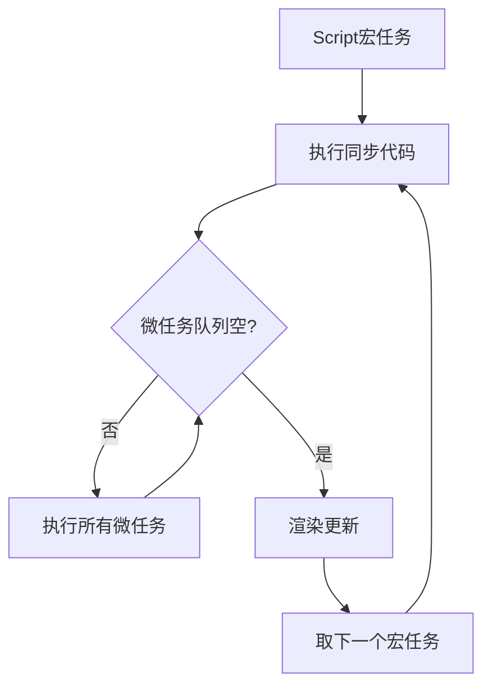

# 宏任务与微任务的区分与执行机制

## 一、为什么要区分宏任务和微任务？

在 JavaScript 的事件循环(Event Loop)机制中，区分宏任务和微任务主要出于以下设计考量：

### 1. 任务优先级管理
- **微任务**：需要更高优先级执行的任务（如Promise回调、DOM变更）
- **宏任务**：可以稍后执行的常规任务（如setTimeout、事件回调）

### 2. 性能优化
- 微任务能在当前任务结束后立即执行，避免不必要的重绘/重排
- 宏任务让浏览器有机会在任务之间执行渲染

### 3. 执行时序保证
```javascript
// 示例：保证DOM更新后执行回调
element.textContent = '新内容';
Promise.resolve().then(() => {
  console.log('DOM已更新');
});
```

### 4. 避免阻塞
- 长宏任务可以被拆解
- 关键微任务能及时处理

## 二、执行优先级规则

### 1. 基本规则
```
事件循环单次流程：
1. 执行一个宏任务（从宏任务队列）
2. 执行所有可用的微任务（清空微任务队列）
3. 必要时渲染UI
4. 开始下一轮循环
```

### 2. 可视化流程


### 3. 代码验证示例

```javascript
// @playground
console.log('脚本开始'); // 同步代码

setTimeout(() => {
  console.log('setTimeout'); // 宏任务
}, 0);

Promise.resolve().then(() => {
  console.log('Promise1'); // 微任务
}).then(() => {
  console.log('Promise2'); // 微任务
});

console.log('脚本结束'); // 同步代码

/* 输出顺序：
脚本开始
脚本结束
Promise1
Promise2
setTimeout
*/
```

## 三、任务类型分类

### 1. 常见宏任务
| 类型                | 示例                     | 触发时机               |
|---------------------|--------------------------|-----------------------|
| script整体代码       | `<script>`标签内容        | 初始执行              |
| setTimeout/setInterval | 定时器回调              | 定时器到期            |
| DOM事件              | click/keydown等事件       | 事件触发              |
| I/O操作              | 文件读写回调              | 操作完成              |
| postMessage          | 跨窗口通信                | 消息接收              |
| requestAnimationFrame | 动画帧回调               | 下次重绘前            |

### 2. 常见微任务
| 类型                | 示例                     | 触发时机               |
|---------------------|--------------------------|-----------------------|
| Promise             | then/catch/finally       | Promise状态变更       |
| MutationObserver    | DOM变更观察               | DOM变更完成           |
| process.nextTick    | Node.js环境              | 当前阶段结束          |
| queueMicrotask      | 标准API                  | 显式调用              |

## 四、高级执行场景

### 1. 嵌套任务示例
```javascript
// @playground
console.log('外层脚本');

setTimeout(() => {
  console.log('宏任务1');
  Promise.resolve().then(() => {
    console.log('宏任务1的微任务');
  });
}, 0);

Promise.resolve().then(() => {
  console.log('微任务1');
  setTimeout(() => {
    console.log('微任务1的宏任务');
  }, 0);
});

/* 输出顺序：
外层脚本
微任务1
宏任务1
宏任务1的微任务
微任务1的宏任务
*/
```

### 2. 渲染时机影响
```javascript
// @playground
function runTest() {
  const el = document.createElement('div');
  el.textContent = '初始内容';
  document.body.appendChild(el);

  // 宏任务修改
  setTimeout(() => {
    el.textContent = '宏任务修改';
    console.log('宏任务完成');
  }, 0);

  // 微任务修改
  Promise.resolve().then(() => {
    el.textContent = '微任务修改';
    console.log('微任务完成');
  });
}

runTest();

/* 典型输出：
微任务完成
宏任务完成
*/
```

## 五、设计原理详解

### 1. 微任务的必要性
- **及时性**：保证Promise等异步操作尽快执行
- **原子性**：确保相关操作在同一个渲染周期完成
- **效率**：避免不必要的UI中间状态

### 2. 浏览器实现差异
| 浏览器         | 微任务执行时机                  |
|---------------|--------------------------------|
| Chrome        | 每个宏任务后立即执行            |
| Firefox       | 类似Chrome但有微小差异          |
| Safari        | 有时会合并连续微任务            |

## 六、开发实践建议

### 1. 合理选择任务类型
```javascript
// 需要快速响应的操作
function urgentTask() {
  // 使用微任务
  Promise.resolve().then(processData);
}

// 可以延迟的操作
function backgroundTask() {
  // 使用宏任务
  setTimeout(analyzeData, 0);
}
```

### 2. 避免常见陷阱
```javascript
// 错误示例：在循环中创建大量微任务
function badPractice() {
  for (let i = 0; i < 10000; i++) {
    Promise.resolve().then(() => {
      // 阻塞事件循环
    });
  }
}

// 正确做法：批量处理
function goodPractice() {
  const batch = [];
  for (let i = 0; i < 10000; i++) {
    batch.push(i);
  }
  Promise.resolve().then(() => {
    processBatch(batch);
  });
}
```

### 3. 性能优化技巧
```javascript
// 将长任务分解为多个宏任务
function processLargeData(data) {
  let chunkSize = 1000;
  let index = 0;
  
  function processChunk() {
    const chunk = data.slice(index, index + chunkSize);
    // 处理数据块...
    
    index += chunkSize;
    if (index < data.length) {
      // 使用setTimeout(0)让出控制权
      setTimeout(processChunk, 0);
    }
  }
  
  processChunk();
}
```

## 七、通俗总结

**为什么区分？**
- 就像医院急诊分诊：
  - 微任务 = 急诊病人（优先处理）
  - 宏任务 = 普通门诊（按顺序处理）
- 保证关键任务及时完成，同时维持系统整体响应

**执行顺序口诀**：
"同步代码先执行，微任务队立即清；
一个宏任务走一轮，渲染之前查微任。" 

**实际意义**：
1. Promise回调总比setTimeout先执行
2. DOM更新后能立即获取最新状态
3. 避免长时间任务阻塞关键操作
4. 为框架(如Vue)提供可靠的异步更新机制
