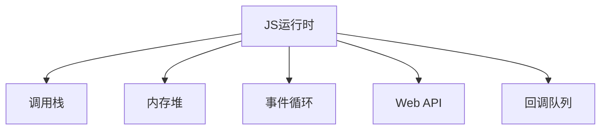

# JavaScript 运行时（Runtime）详解

## 开场白

"关于 JavaScript 运行时的问题，这是一个理解 JS 执行机制的核心概念。让我结合五年开发经验，从理论到实践为您系统讲解。"

## 核心回答

### 1. 什么是运行时？

"JavaScript 运行时（Runtime）是指执行 JavaScript 代码的完整环境，它包含了代码执行所需的所有组件和服务。我们可以把它想象成一个'代码加工厂'，包含以下核心部件："



### 2. 浏览器中的运行时组成

"以浏览器环境为例，运行时的主要组件包括："

```javascript
// @环境: 浏览器控制台
// 示例1：展示运行时各部分的交互
function runtimeDemo() {
    // 1. 调用栈（Call Stack）
    function first() {
        console.log('第一层栈');
        second();
    }
    
    function second() {
        console.log('第二层栈');
        third();
    }
    
    function third() {
        console.log('第三层栈');
    }
    
    first(); // 触发调用栈演示
    
    // 2. 事件循环（Event Loop）
    setTimeout(() => {
        console.log('来自回调队列的消息');
    }, 0);
    
    console.log('同步代码结束');
}

runtimeDemo();
/* 输出顺序：
第一层栈
第二层栈
第三层栈
同步代码结束
来自回调队列的消息
*/
```

### 3. Node.js 运行时差异

"Node.js 运行时与浏览器有些不同，它增加了更多服务器端能力："

```javascript
// @环境: Node.js 12+
// 示例2：Node.js特有运行时组件
const fs = require('fs');

// 1. 特有API模块
fs.readFile(__filename, (err, data) => {
    console.log('文件读取完成');
});

// 2. 不同的事件循环阶段
setImmediate(() => {
    console.log('immediate阶段');
});

process.nextTick(() => {
    console.log('nextTick微任务');
});

/* 输出顺序：
nextTick微任务
immediate阶段
文件读取完成
*/
```

### 4. 运行时关键概念示例

"让我们通过具体示例演示运行时的核心机制："

```javascript
// @环境: 浏览器控制台
// 示例3：内存管理与垃圾回收
function memoryDemo() {
    let bigData = new Array(1000000).fill('数据'); // 分配在堆内存
    
    // 手动解除引用
    document.getElementById('myButton').addEventListener('click', () => {
        console.log(bigData[0]); // 闭包保持引用
    });
    
    // 模拟内存泄漏
    window.leak = bigData.slice(0, 10000); // 全局变量不会被回收
}

// 示例4：事件循环优先级
function eventLoopDemo() {
    // 宏任务 vs 微任务
    setTimeout(() => console.log('宏任务1'), 0);
    
    Promise.resolve().then(() => console.log('微任务1'));
    
    setTimeout(() => console.log('宏任务2'), 0);
    
    Promise.resolve().then(() => console.log('微任务2'));
    
    console.log('同步代码');
}

eventLoopDemo();
/* 输出顺序：
同步代码
微任务1
微任务2
宏任务1
宏任务2
*/
```

## 可运行完整示例

```html
<!DOCTYPE html>
<!-- @环境: 现代浏览器 -->
<html>
<head>
    <title>运行时演示</title>
</head>
<body>
    <button id="demoBtn">运行演示</button>
    <script>
        // 完整运行时演示
        class RuntimeDemo {
            constructor() {
                this.heapMemory = [];
                this.btn = document.getElementById('demoBtn');
                this.bindEvents();
            }
            
            bindEvents() {
                this.btn.addEventListener('click', this.handleClick.bind(this));
                
                // 微任务队列演示
                Promise.resolve().then(() => {
                    console.log('微任务：DOM未完全加载');
                });
            }
            
            handleClick() {
                // 调用栈演示
                this.firstLayer();
                
                // 异步操作演示
                setTimeout(() => {
                    console.log('宏任务：setTimeout回调');
                    this.allocateMemory(1000); // 内存操作
                }, 100);
                
                // 渲染时机演示
                requestAnimationFrame(() => {
                    console.log('渲染前回调');
                });
            }
            
            firstLayer() {
                console.log('调用栈第一层');
                this.secondLayer();
            }
            
            secondLayer() {
                console.log('调用栈第二层');
                this.thirdLayer();
            }
            
            thirdLayer() {
                console.log('调用栈第三层');
            }
            
            allocateMemory(size) {
                // 堆内存分配
                this.heapMemory.push(new Array(size).fill('数据块'));
                console.log(`已分配 ${size}KB 内存`);
                
                // 模拟内存泄漏
                if (size > 500) {
                    window.memoryLeak = this.heapMemory.slice();
                }
            }
        }
        
        // 页面加载完成事件
        window.addEventListener('DOMContentLoaded', () => {
            console.log('DOM已加载 - 运行时初始化');
            new RuntimeDemo();
        });
    </script>
</body>
</html>
```

## 通俗易懂的总结

"理解 JavaScript 运行时就像了解一个高效工厂的运作：

1. **调用栈是生产线**：
   - 同步代码像传送带上的产品，顺序处理
   - 函数调用像不同加工工序，层层堆叠

2. **内存堆是仓库**：
   - 对象和闭包是存储的原料
   - 垃圾回收是定期清理过期库存

3. **事件循环是调度中心**：
   - 微任务（Promise）是VIP订单，优先处理
   - 宏任务（setTimeout）是普通订单，排队等待
   - 渲染是质检环节，保证最终输出质量

**关键点记忆**：
- 浏览器和Node.js运行时结构不同
- 微任务优先于宏任务执行
- 闭包会影响内存回收
- 调用栈深度有限（栈溢出错误）

在实际项目中，理解运行时帮助我：
1. 优化性能（合理安排任务优先级）
2. 避免内存泄漏（特别是SPA应用）
3. 解决异步执行顺序问题
4. 编写更高效的动画和交互代码"

"掌握运行时机制，就像获得了JavaScript引擎的内部操作手册，能让我们写出更专业、更可靠的代码。"
