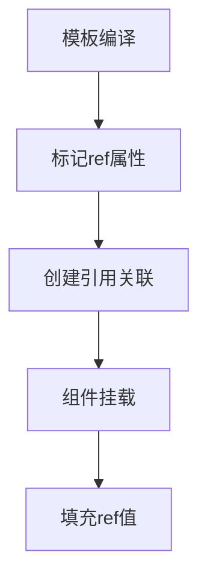
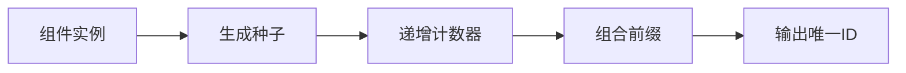

# 依赖注入以及辅助

## Vue 依赖注入与 provide() 详解

作为 Vue 的核心功能之一，依赖注入（Dependency Injection）为组件间通信提供了优雅的解决方案，特别适合多层嵌套组件场景。下面我将从基础概念到实际应用，逐步解析这一机制。

### 一、依赖注入的基本概念

依赖注入是 Vue 提供的一种组件通信方式，允许祖先组件向其所有子孙后代注入依赖，而不需要层层传递 props。这解决了"prop 逐级透传"的问题。

主要包含两个 API：
- `provide()`：在祖先组件提供数据
- `inject()`：在子孙组件注入数据

### 二、provide() 详解

`provide()` 函数接收两个参数：

```js
provide(key, value)
```

- `key`：可以是字符串或 Symbol，作为注入的标识符
- `value`：要提供的值，可以是任意类型（包括响应式数据）

#### 基本使用示例

```vue
<!-- AncestorComponent.vue -->
<script setup>
import { provide, ref } from 'vue'

// 提供静态值
provide('appTheme', 'dark')

// 提供响应式数据
const user = ref({ name: 'Alice', age: 28 })
provide('userData', user)
</script>
```

### 三、完整可运行示例

下面是一个完整的父子孙组件示例：

```vue
<!-- App.vue -->
<script setup>
import { provide, ref } from 'vue'
import ParentComponent from './ParentComponent.vue'

const counter = ref(0)
const increment = () => counter.value++

// 提供多个依赖
provide('globalCounter', {
  count: counter,
  increment
})

provide('appName', 'Vue Dependency Injection Demo')
</script>

<template>
  <div class="app">
    <h2>Root Component</h2>
    <p>Current count: {{ counter }}</p>
    <ParentComponent />
  </div>
</template>
```

```vue
<!-- ParentComponent.vue -->
<script setup>
import ChildComponent from './ChildComponent.vue'
</script>

<template>
  <div class="parent">
    <h3>Parent Component</h3>
    <ChildComponent />
  </div>
</template>
```

```vue
<!-- ChildComponent.vue -->
<script setup>
import { inject } from 'vue'

// 注入依赖
const { count, increment } = inject('globalCounter')
const appName = inject('appName')
</script>

<template>
  <div class="child">
    <h4>Child Component</h4>
    <p>App Name: {{ appName }}</p>
    <p>Count from root: {{ count }}</p>
    <button @click="increment">Increment</button>
  </div>
</template>
```

### 四、高级用法

#### 1. 提供响应式数据

```vue
<script setup>
import { provide, reactive } from 'vue'

const userSettings = reactive({
  theme: 'dark',
  notifications: true
})

provide('settings', userSettings)
</script>
```

#### 2. 提供函数方法

```vue
<script setup>
import { provide } from 'vue'

const showNotification = (message) => {
  alert(message)
}

provide('notify', showNotification)
</script>
```

#### 3. 使用 Symbol 作为 key

```js
// constants.js
export const USER_KEY = Symbol()

// 父组件
import { USER_KEY } from './constants'
provide(USER_KEY, userData)

// 子组件
const user = inject(USER_KEY)
```

### 五、最佳实践与注意事项

1. **命名规范**：建议使用有意义的命名或 Symbol 避免冲突
2. **响应式数据**：确保提供的响应式数据使用 ref/reactive
3. **默认值**：可以为注入的值提供默认值
   ```js
   const value = inject('key', 'default value')
   ```
4. **类型安全**：使用 TypeScript 时，可以标注类型
   ```ts
   const user = inject<User>('user')
   ```

### 六、通俗总结

可以把依赖注入想象成一个家族信托基金：
- **provide()** 就像长辈设立信托（提供资产）
- **inject()** 就像子孙领取信托（获取资产）
- 不需要每一代都手动传递（避免 prop 透传）
- 任何深度的后代都可以直接获取

这种方式特别适合：
- 全局配置（如主题、用户信息）
- 共享工具函数
- 复杂组件库的上下文传递

相比 Vuex/Pinia，依赖注入更适合组件库或特定组件树的通信场景，保持了更好的封装性。

## Vue 响应式依赖注入：inject() 详解

作为 Vue 依赖注入系统的另一半，`inject()` 与 `provide()` 配合构成了完整的跨组件通信方案。下面我将深入解析 `inject()` 的用法和响应式特性。

### 一、inject() 基础概念

`inject()` 用于在子组件中接收祖先组件通过 `provide()` 提供的数据，其基本语法为：

```js
const value = inject(key, defaultValue)
```

参数说明：
- `key`：与 provide() 提供的键名对应（字符串或 Symbol）
- `defaultValue`（可选）：当未找到对应 key 时的默认值

### 二、核心响应式特性

关键点：**inject 得到的值会保持其原始响应性**：
- 如果 provide 的是 ref/reactive 对象，inject 后仍然是响应式的
- 修改注入的值会同步更新到所有注入该值的组件

#### 基础示例

```vue
<!-- RootComponent.vue -->
<script setup>
import { provide, ref } from 'vue'
import ChildComponent from './ChildComponent.vue'

const counter = ref(0)
provide('counter', counter) // 提供响应式数据
</script>

<template>
  <div>
    <button @click="counter++">Root +1 ({{ counter }})</button>
    <ChildComponent />
  </div>
</template>
```

```vue
<!-- ChildComponent.vue -->
<script setup>
import { inject } from 'vue'

// 注入响应式数据
const counter = inject('counter')
</script>

<template>
  <div>
    <button @click="counter++">Child +1 ({{ counter }})</button>
  </div>
</template>
```

### 三、完整可运行示例

下面是一个展示响应式注入的完整案例：

```vue
<!-- App.vue -->
<script setup>
import { provide, reactive } from 'vue'
import ParentComponent from './ParentComponent.vue'

// 提供响应式对象
const user = reactive({
  name: 'Alice',
  permissions: ['read', 'write']
})

provide('userData', user)
</script>

<template>
  <div class="app">
    <h2>Root Component</h2>
    <p>User: {{ user.name }}</p>
    <ParentComponent />
  </div>
</template>
```

```vue
<!-- ParentComponent.vue -->
<script setup>
import ChildComponent from './ChildComponent.vue'
</script>

<template>
  <div class="parent">
    <h3>Parent Component</h3>
    <ChildComponent />
  </div>
</template>
```

```vue
<!-- ChildComponent.vue -->
<script setup>
import { inject } from 'vue'

// 注入响应式对象
const user = inject('userData')

const updateName = () => {
  user.name = 'Bob' // 修改会影响所有使用该数据的组件
}
</script>

<template>
  <div class="child">
    <h4>Child Component</h4>
    <p>Injected User: {{ user.name }}</p>
    <button @click="updateName">Change Name</button>
    
    <ul>
      <li v-for="perm in user.permissions" :key="perm">
        {{ perm }}
      </li>
    </ul>
  </div>
</template>
```

### 四、高级用法

#### 1. 处理可选注入

```vue
<script setup>
// 提供默认值
const theme = inject('theme', 'light')
</script>
```

#### 2. 注入函数

```vue
<!-- 祖先组件 -->
<script setup>
const log = (message) => console.log(message)
provide('logger', log)
</script>

<!-- 后代组件 -->
<script setup>
const logger = inject('logger')
logger('This is a message from child')
</script>
```

#### 3. 使用工厂函数默认值

```vue
<script setup>
const config = inject('config', () => ({
  timeout: 3000,
  retries: 3
}))
</script>
```

#### 4. TypeScript 类型提示

```vue
<script setup lang="ts">
interface User {
  id: number
  name: string
}

const user = inject<User>('user')!
</script>
```

### 五、响应式原理剖析

当通过 `inject` 获取响应式数据时，Vue 会保持其响应性链接：

```js
// 祖先组件
const state = reactive({ count: 0 })
provide('state', state)

// 后代组件
const injectedState = inject('state')
injectedState.count++ // 会触发祖先组件的更新
```

这是因为 Vue 的响应式系统基于 Proxy，注入的对象仍然是同一个响应式代理。

### 六、最佳实践

1. **命名空间**：建议使用有特定前缀的 key 避免冲突
   ```js
   provide('my-app:theme', 'dark')
   ```
   
2. **只读控制**：需要防止意外修改时
   ```js
   provide('readonlyData', readonly(data))
   ```

3. **响应式转换**：确保提供的数据是响应式的
   ```js
   provide('data', reactive(originalData))
   ```

### 七、通俗总结

可以把 `inject()` 想象成：
- **无线充电**：只要在范围内（组件树内）就能自动获取能量（数据）
- **共享内存**：所有组件访问的是同一块内存地址
- **家族遗传**：祖先的特征（数据）会自然传递给后代

与 props 相比的优势：
- 避免"层层传递"的繁琐
- 跨越多级组件直接通信
- 保持响应式特性不变

注意事项：
- 不要滥用，适合跨层级通信场景
- 对于全局状态，Pinia 可能更合适
- 明确的 key 命名可以避免冲突

## Vue 依赖注入与 hasInjectionContext() 深度解析

作为 Vue 依赖注入系统的高级用法，`hasInjectionContext()` 是一个实用的工具函数，可以帮助我们更好地控制依赖注入的行为。下面我将从基础到高级全面讲解这个机制。

### 一、依赖注入核心回顾

依赖注入系统包含三个核心部分：
- `provide()` - 提供数据
- `inject()` - 注入数据
- `hasInjectionContext()` - 检查当前注入上下文

### 二、hasInjectionContext() 详解

#### 基本定义

```typescript
function hasInjectionContext(): boolean
```

这个函数用于**检测当前组件是否具有注入上下文**，主要用在以下场景：
- 在非组件环境中使用 inject() 前进行检查
- 开发可复用组合式函数时进行安全校验
- 避免在错误的生命周期中调用注入

#### 典型使用场景

```vue
<script setup>
import { hasInjectionContext, inject } from 'vue'

function useSafeInject() {
  if (!hasInjectionContext()) {
    throw new Error('必须在组件上下文中使用')
  }
  return inject('my-key')
}
</script>
```

### 三、完整可运行示例

下面是一个展示依赖注入完整流程和上下文检查的示例：

```vue
<!-- App.vue -->
<script setup>
import { provide } from 'vue'
import ChildComponent from './ChildComponent.vue'

provide('app-config', {
  theme: 'dark',
  apiBase: 'https://api.example.com'
})
</script>

<template>
  <div>
    <h2>Application Root</h2>
    <ChildComponent />
  </div>
</template>
```

```vue
<!-- ChildComponent.vue -->
<script setup>
import { inject, hasInjectionContext } from 'vue'
import GrandChildComponent from './GrandChildComponent.vue'

// 安全注入检查
if (!hasInjectionContext()) {
  console.warn('当前不在注入上下文中')
}

const config = inject('app-config')
</script>

<template>
  <div>
    <h3>Child Component</h3>
    <p>Current theme: {{ config.theme }}</p>
    <GrandChildComponent />
  </div>
</template>
```

```vue
<!-- GrandChildComponent.vue -->
<script setup>
import { inject, hasInjectionContext } from 'vue'

// 组合式函数中使用
function useConfig() {
  if (!hasInjectionContext()) {
    return { theme: 'default', apiBase: '' }
  }
  return inject('app-config')
}

const config = useConfig()
</script>

<template>
  <div>
    <h4>GrandChild Component</h4>
    <p>API Base: {{ config.apiBase }}</p>
  </div>
</template>
```

### 四、高级应用场景

#### 1. 在工具函数中安全使用注入

```js
// utils.js
import { hasInjectionContext, inject } from 'vue'

export function getTheme() {
  if (hasInjectionContext()) {
    return inject('theme', 'light')
  }
  return 'light'
}
```

#### 2. 生命周期钩子中的检查

```vue
<script setup>
import { onMounted, hasInjectionContext } from 'vue'

onMounted(() => {
  if (hasInjectionContext()) {
    // 安全使用注入
  } else {
    console.warn('在非组件上下文中调用')
  }
})
</script>
```

#### 3. 插件开发中的应用

```js
// 插件定义
export default {
  install(app) {
    // 在插件安装时检查
    if (!hasInjectionContext()) {
      console.warn('插件需要在应用上下文中安装')
      return
    }
    
    app.provide('plugin-data', {})
  }
}
```

### 五、原理剖析

`hasInjectionContext()` 的工作原理：

1. Vue 在初始化组件时会建立注入上下文
2. 这个上下文与当前组件实例关联
3. 函数通过检查当前活跃实例判断是否存在上下文

```mermaid
graph TD
    A[组件创建] --> B[建立注入上下文]
    B --> C[hasInjectionContext()返回true]
    D[非组件环境] --> E[hasInjectionContext()返回false]
```

### 六、最佳实践

1. **防御性编程**：在可能被多场景使用的工具函数中始终检查
2. **错误处理**：提供有意义的回退方案或错误提示
3. **性能优化**：避免在热代码路径中频繁调用
4. **组合式函数**：开发可复用的 composables 时特别有用

### 七、通俗总结

可以把 `hasInjectionContext()` 理解为：

- **环境检测器**：就像手机的GPS，告诉你当前是否在可定位区域
- **安全开关**：确保依赖注入只在正确的环境中使用
- **上下文雷达**：探测当前是否处于有效的Vue组件环境中

与普通依赖注入的关系：
- 就像"安全带"之于"驾驶" - 不是必须的，但能确保安全
- 为依赖注入增加了一层保护机制
- 特别适合开发需要高可靠性的库和工具

记住这个简单法则：
> "当你不确定代码会在哪里运行时，先用 hasInjectionContext() 检查一下"

## Vue 辅助函数 useAttrs() 深度解析

`useAttrs()` 是 Vue 3 提供的一个实用组合式函数，用于访问组件的非 props 属性（Attributes）。下面我将从基础到高级全面讲解这个功能。

### 一、useAttrs() 基础概念

#### 核心作用
`useAttrs()` 返回一个包含所有**未声明为 props 的组件属性**的对象，包括：
- 普通的 HTML 属性（如 `class`, `style`）
- 自定义事件监听器（如 `@click`）
- 未声明的自定义属性

#### 基本用法
```js
const attrs = useAttrs()
```

### 二、完整可运行示例

下面是一个展示 `useAttrs()` 实际应用的完整案例：

```vue
<!-- ParentComponent.vue -->
<script setup>
import ChildComponent from './ChildComponent.vue'
</script>

<template>
  <ChildComponent
    class="child-wrapper"
    data-test="child-element"
    @custom-event="handleEvent"
    title="Tooltip text"
    style="color: blue"
    unregistered-prop="value"
  />
</template>
```

```vue
<!-- ChildComponent.vue -->
<script setup>
import { useAttrs } from 'vue'

const attrs = useAttrs()

// 控制台输出所有非props属性
console.log(attrs)
/*
{
  class: "child-wrapper",
  "data-test": "child-element",
  title: "Tooltip text",
  style: "color: blue",
  "unregistered-prop": "value",
  onCustomEvent: ƒ ()
}
*/
</script>

<template>
  <div>
    <h3>Child Component</h3>
    <!-- 手动绑定所有属性 -->
    <div v-bind="attrs">
      这个div继承了所有非props属性
    </div>
    
    <!-- 单独使用特定属性 -->
    <button :title="attrs.title">
      悬停查看提示
    </button>
  </div>
</template>
```

### 三、高级用法

#### 1. 属性透传控制

```vue
<script setup>
import { useAttrs } from 'vue'

const attrs = useAttrs()

// 过滤掉不需要的属性
const filteredAttrs = {
  ...attrs,
  class: undefined // 移除class属性
}
</script>

<template>
  <input v-bind="filteredAttrs" />
</template>
```

#### 2. 与 inheritAttrs 配合使用

```vue
<script>
export default {
  inheritAttrs: false // 禁用自动属性继承
}
</script>

<script setup>
import { useAttrs } from 'vue'

const attrs = useAttrs()
</script>

<template>
  <div>
    <!-- 手动控制属性应用位置 -->
    <button v-bind="attrs">自定义按钮</button>
  </div>
</template>
```

#### 3. 动态属性处理

```vue
<script setup>
import { useAttrs, computed } from 'vue'

const attrs = useAttrs()

// 动态处理class
const combinedClass = computed(() => 
  `base-class ${attrs.class || ''}`
)
</script>

<template>
  <div :class="combinedClass">
    动态合并class示例
  </div>
</template>
```

#### 4. TypeScript 支持

```vue
<script setup lang="ts">
import { useAttrs } from 'vue'

interface CustomAttrs {
  'data-test'?: string
  'aria-role'?: string
}

const attrs = useAttrs<CustomAttrs>()
</script>
```

### 四、最佳实践

1. **明确属性用途**：区分哪些属性应该作为 props，哪些应该作为 attrs
2. **属性过滤**：在组件边界过滤掉不需要透传的属性
3. **性能优化**：避免在渲染函数中频繁访问 attrs
4. **命名规范**：对于自定义属性使用明确的命名约定

### 五、原理剖析

`useAttrs()` 的工作原理：

1. Vue 在编译阶段会收集所有模板上的属性
2. 已声明的 props 会被分离出来
3. 剩余属性会被存储在组件的 `attrs` 对象中
4. `useAttrs()` 提供了对这个对象的访问

```mermaid
graph TD
    A[模板属性] --> B{是否声明为props?}
    B -->|是| C[props对象]
    B -->|否| D[attrs对象]
    D --> E[通过useAttrs()访问]
```

### 六、常见问题解决方案

#### 问题1：属性冲突
```vue
<script setup>
const attrs = useAttrs()

// 解决class合并问题
const resolvedClass = computed(() => 
  `base-class ${attrs.class || ''}`
)
</script>
```

#### 问题2：事件监听器处理
```vue
<script setup>
const attrs = useAttrs()

const handleClick = (e) => {
  // 先执行自定义逻辑
  console.log('内部处理')
  
  // 再执行外部传入的处理函数
  if (attrs.onClick) {
    attrs.onClick(e)
  }
}
</script>
```

### 七、通俗总结

可以把 `useAttrs()` 理解为：

- **属性收集器**：收集所有"未明确定义"的组件属性
- **属性转发器**：帮助实现属性透传功能
- **属性过滤器**：可以筛选和修改传入的属性

与普通 props 的关系：
- 就像"正式收件"和"快递代收"的区别
- props 是预先声明好的"正式收件"
- attrs 是未声明的"快递代收"

使用场景判断法则：
> "当你需要处理组件上那些没有预先声明的属性时，就该考虑 useAttrs() 了"

记住三个关键点：
1. 用于访问非 props 属性
2. 常用于高阶组件和属性透传
3. 可以与 `inheritAttrs: false` 配合实现精细控制

## Vue 辅助函数 useSlots() 深度解析

`useSlots()` 是 Vue 3 组合式 API 中用于访问组件插槽内容的实用函数。下面我将从基础概念到高级用法，全面讲解这个功能。

### 一、useSlots() 基础概念

#### 核心作用
`useSlots()` 返回一个包含所有插槽的对象，允许开发者：
- 检查插槽是否存在
- 访问插槽内容
- 动态操作插槽

#### 基本用法
```js
const slots = useSlots()
```

### 二、完整可运行示例

#### 示例1：基础插槽检测

```vue
<!-- ParentComponent.vue -->
<script setup>
import ChildComponent from './ChildComponent.vue'
</script>

<template>
  <ChildComponent>
    <template #header>
      <h2>自定义标题</h2>
    </template>
    
    <p>默认插槽内容</p>
    
    <template #footer>
      <button>点击</button>
    </template>
  </ChildComponent>
</template>
```

```vue
<!-- ChildComponent.vue -->
<script setup>
import { useSlots } from 'vue'

const slots = useSlots()

// 检测插槽是否存在
const hasHeader = !!slots.header
const hasDefault = !!slots.default
const hasFooter = !!slots.footer
</script>

<template>
  <div class="card">
    <!-- 条件渲染插槽 -->
    <header v-if="hasHeader">
      <slot name="header" />
    </header>
    
    <div class="content">
      <slot />
    </div>
    
    <footer v-if="hasFooter">
      <slot name="footer" />
    </footer>
  </div>
</template>
```

#### 示例2：作用域插槽处理

```vue
<!-- ParentComponent.vue -->
<script setup>
import ScopedChild from './ScopedChild.vue'
</script>

<template>
  <ScopedChild>
    <template #item="{ data }">
      <div>{{ data.name }} - {{ data.price }}元</div>
    </template>
  </ScopedChild>
</template>
```

```vue
<!-- ScopedChild.vue -->
<script setup>
import { useSlots } from 'vue'

const slots = useSlots()
const items = [
  { id: 1, name: '商品A', price: 100 },
  { id: 2, name: '商品B', price: 200 }
]
</script>

<template>
  <ul>
    <li v-for="item in items" :key="item.id">
      <!-- 传递作用域数据 -->
      <slot name="item" :data="item" />
    </li>
  </ul>
</template>
```

### 三、高级用法

#### 1. 动态插槽名

```vue
<script setup>
import { useSlots, computed } from 'vue'

const slots = useSlots()
const slotNames = computed(() => Object.keys(slots))
</script>

<template>
  <div v-for="name in slotNames" :key="name">
    <slot :name="name" />
  </div>
</template>
```

#### 2. 插槽内容转换

```vue
<script setup>
import { useSlots } from 'vue'

const slots = useSlots()

// 转换插槽内容
const processedHeader = () => {
  if (slots.header) {
    return <div class="enhanced-header">{slots.header()}</div>
  }
  return null
}
</script>

<template>
  <div>
    <render :vnode="processedHeader()" />
    <slot />
  </div>
</template>
```

#### 3. 与 TypeScript 配合

```vue
<script setup lang="ts">
import { useSlots } from 'vue'

// 定义插槽类型
interface Slots {
  default?: () => VNode[]
  header?: (props: { title: string }) => VNode[]
  footer?: () => VNode[]
}

const slots = useSlots() as Slots
</script>
```

### 四、最佳实践

1. **防御性编程**：始终检查插槽是否存在
2. **性能优化**：避免在渲染函数中频繁调用 slots
3. **明确类型**：使用 TypeScript 定义插槽类型
4. **命名规范**：使用有意义的插槽名称

### 五、原理剖析

`useSlots()` 的工作原理：

1. Vue 在编译模板时会收集所有插槽内容
2. 这些内容被存储在组件实例的 slots 对象中
3. `useSlots()` 提供了对这个对象的访问
4. 每个插槽都是一个返回 VNode 数组的函数

```mermaid
graph TD
    A[模板插槽] --> B[编译阶段]
    B --> C[创建slots对象]
    C --> D[通过useSlots()暴露]
    D --> E[组件渲染时调用]
```

### 六、常见问题解决方案

#### 问题1：插槽内容操作

```vue
<script setup>
import { useSlots } from 'vue'

const slots = useSlots()

// 克隆并修改插槽内容
const modifiedDefaultSlot = () => {
  if (!slots.default) return null
  return slots.default().map(vnode => {
    return h(vnode.type, {
      ...vnode.props,
      class: 'modified-class'
    }, vnode.children)
  })
}
</script>
```

#### 问题2：插槽回退内容

```vue
<script setup>
import { useSlots } from 'vue'

const slots = useSlots()
</script>

<template>
  <div>
    <slot name="header">
      <!-- 默认回退内容 -->
      <h2>默认标题</h2>
    </slot>
  </div>
</template>
```

### 七、通俗总结

可以把 `useSlots()` 理解为：

- **插槽探测器**：告诉你组件被传递了哪些插槽内容
- **内容中转站**：让你能够操作和转换插槽内容
- **动态渲染控制器**：基于插槽存在与否控制渲染逻辑

与普通插槽的关系：
- 就像"直接阅读信件"和"先检查信箱再决定是否读信"的区别
- 普通插槽是直接渲染
- useSlots() 让你可以先检查再决定如何渲染

使用场景判断法则：
> "当需要根据插槽内容动态决定渲染逻辑时，useSlots() 就是你的最佳选择"

记住三个关键点：
1. 用于访问和操作插槽内容
2. 特别适合动态插槽名和条件渲染
3. 可以与作用域插槽配合实现灵活的数据传递

## Vue 辅助函数 useModel() 深度解析

`useModel()` 是 Vue 3.3+ 新增的一个组合式 API，用于简化组件的双向绑定实现。下面我将详细介绍这个实用的功能。

### 一、useModel() 基础概念

#### 核心作用
`useModel()` 提供了一种声明式的方式来实现组件的 `v-model` 双向绑定，主要解决以下问题：
- 简化自定义组件的 `v-model` 实现
- 统一处理 `v-model` 的各种修饰符
- 提供类型安全的双向绑定

#### 基本语法
```js
const modelValue = useModel(props, 'modelValue', { local: true })
```

参数说明：
1. `props`：组件 props 对象
2. `modelName`：绑定的属性名（默认为 'modelValue'）
3. `options`：配置选项（可选）

### 二、完整可运行示例

#### 示例1：基础用法

```vue
<!-- ParentComponent.vue -->
<script setup>
import CustomInput from './CustomInput.vue'
import { ref } from 'vue'

const inputValue = ref('初始值')
</script>

<template>
  <div>
    <p>父组件值: {{ inputValue }}</p>
    <CustomInput v-model="inputValue" />
  </div>
</template>
```

```vue
<!-- CustomInput.vue -->
<script setup>
import { useModel } from 'vue'

const props = defineProps({
  modelValue: {
    type: String,
    required: true
  }
})

// 使用 useModel 创建双向绑定
const value = useModel(props)
</script>

<template>
  <input
    type="text"
    :value="value"
    @input="value = $event.target.value"
  />
</template>
```

#### 示例2：多 v-model 绑定

```vue
<!-- ParentComponent.vue -->
<script setup>
import UserForm from './UserForm.vue'
import { ref } from 'vue'

const name = ref('')
const age = ref(0)
</script>

<template>
  <UserForm 
    v-model:name="name"
    v-model:age="age"
  />
</template>
```

```vue
<!-- UserForm.vue -->
<script setup>
import { useModel } from 'vue'

const props = defineProps({
  name: String,
  age: Number
})

// 多个 useModel 绑定
const nameModel = useModel(props, 'name')
const ageModel = useModel(props, 'age')
</script>

<template>
  <div>
    <label>姓名:
      <input v-model="nameModel" />
    </label>
    
    <label>年龄:
      <input 
        type="number" 
        v-model.number="ageModel" 
      />
    </label>
  </div>
</template>
```

### 三、高级用法

#### 1. 自定义转换逻辑

```vue
<script setup>
import { useModel } from 'vue'

const props = defineProps({
  modelValue: Number
})

const value = useModel(props, undefined, {
  // 输入时转换为数字
  set(value) {
    return Number(value) || 0
  }
})
</script>
```

#### 2. 处理修饰符

```vue
<script setup>
import { useModel } from 'vue'

const props = defineProps({
  modelValue: String,
  modelModifiers: {
    type: Object,
    default: () => ({})
  }
})

const value = useModel(props, undefined, {
  // 根据修饰符处理值
  set(value) {
    if (props.modelModifiers.uppercase) {
      return value.toUpperCase()
    }
    return value
  }
})
</script>
```

#### 3. TypeScript 支持

```vue
<script setup lang="ts">
import { useModel } from 'vue'

interface Props {
  modelValue: string
  modelModifiers?: {
    trim?: boolean
  }
}

const props = defineProps<Props>()

const value = useModel(props, undefined, {
  set(value: string) {
    return props.modelModifiers?.trim 
      ? value.trim() 
      : value
  }
})
</script>
```

### 四、最佳实践

1. **明确命名**：对于多个 `v-model` 使用明确的参数名
2. **类型安全**：始终为 `useModel` 提供类型定义
3. **修饰符处理**：考虑所有可能的修饰符情况
4. **性能优化**：避免在 `set` 转换器中进行昂贵操作

### 五、原理剖析

`useModel()` 的工作原理：

1. 监听 props 的变化并更新本地值
2. 当本地值变化时触发 `update:modelValue` 事件
3. 处理修饰符和类型转换
4. 保持与父组件的同步

```mermaid
graph LR
    A[父组件] -->|v-model| B[子组件props]
    B --> C[useModel()]
    C --> D[本地状态]
    D -->|变化| E[触发update事件]
    E --> A
```

### 六、常见问题解决方案

#### 问题1：初始值处理

```vue
<script setup>
import { useModel } from 'vue'

const props = defineProps({
  modelValue: {
    type: String,
    default: '默认值'
  }
})

const value = useModel(props, undefined, {
  local: true // 保持本地状态
})
</script>
```

#### 问题2：复杂对象处理

```vue
<script setup>
import { useModel } from 'vue'

const props = defineProps({
  modelValue: {
    type: Object,
    required: true
  }
})

const value = useModel(props, undefined, {
  deep: true // 深度监听对象变化
})
</script>
```

### 七、通俗总结

可以把 `useModel()` 理解为：

- **双向绑定助手**：简化 `v-model` 的实现
- **数据转换器**：自动处理值的转换和修饰符
- **通信桥梁**：在父子组件间架起数据同步的桥梁

与传统实现的对比优势：
- 更简洁：无需手动定义 emits
- 更灵活：轻松处理多个 `v-model`
- 更安全：内置类型支持

使用场景判断法则：
> "当你需要实现自定义组件的双向绑定时，useModel() 能让代码更简洁高效"

记住三个关键点：
1. 简化 `v-model` 实现
2. 支持多 `v-model` 绑定
3. 可以处理修饰符和类型转换

## Vue 辅助函数 useTemplateRef() 深度解析

`useTemplateRef()` 是 Vue 3 中用于处理模板引用的实用函数，它提供了更灵活的方式来操作 DOM 元素和组件实例。下面我将从基础到高级全面讲解这个功能。

### 一、useTemplateRef() 基础概念

#### 核心作用
`useTemplateRef()` 是 `ref()` 的模板专用版本，主要特点：
- 专为模板引用设计
- 自动处理 null 初始值
- 提供更直观的类型推断

#### 基本语法
```js
const templateRef = useTemplateRef()
```

### 二、完整可运行示例

#### 示例1：基础 DOM 元素引用

```vue
<script setup>
import { useTemplateRef, onMounted } from 'vue'

const inputRef = useTemplateRef()

onMounted(() => {
  // 自动推断为 HTMLInputElement 类型
  inputRef.value?.focus()
})
</script>

<template>
  <input ref="inputRef" type="text" />
</template>
```

#### 示例2：组件实例引用

```vue
<!-- ParentComponent.vue -->
<script setup>
import ChildComponent from './ChildComponent.vue'
import { useTemplateRef } from 'vue'

const childRef = useTemplateRef()

function callChildMethod() {
  childRef.value?.childMethod()
}
</script>

<template>
  <ChildComponent ref="childRef" />
  <button @click="callChildMethod">调用子组件方法</button>
</template>
```

```vue
<!-- ChildComponent.vue -->
<script setup>
defineExpose({
  childMethod() {
    console.log('子组件方法被调用')
  }
})
</script>

<template>
  <div>子组件</div>
</template>
```

### 三、高级用法

#### 1. 动态引用名称

```vue
<script setup>
import { useTemplateRef } from 'vue'

const itemRefs = Array(5).fill(0).map((_, i) => useTemplateRef())

function logRef(index) {
  console.log(itemRefs[index].value)
}
</script>

<template>
  <div v-for="(_, i) in 5" :key="i">
    <button 
      :ref="itemRefs[i]" 
      @click="logRef(i)"
    >
      按钮 {{ i }}
    </button>
  </div>
</template>
```

#### 2. 与 TypeScript 配合

```vue
<script setup lang="ts">
import { useTemplateRef } from 'vue'

interface CustomElement extends HTMLElement {
  customMethod: () => void
}

const customRef = useTemplateRef<CustomElement>()

onMounted(() => {
  customRef.value?.customMethod()
})
</script>

<template>
  <div ref="customRef">自定义元素</div>
</template>
```

#### 3. 组合式函数封装

```js
// useFocus.ts
import { useTemplateRef } from 'vue'

export function useFocus() {
  const target = useTemplateRef<HTMLElement>()
  
  const focus = () => {
    target.value?.focus()
  }
  
  return {
    target,
    focus
  }
}
```

```vue
<script setup>
import { useFocus } from './useFocus'

const { target, focus } = useFocus()
</script>

<template>
  <input ref="target" />
  <button @click="focus">聚焦输入框</button>
</template>
```

### 四、最佳实践

1. **明确类型**：始终为复杂引用提供类型定义
2. **防御性编程**：使用可选链操作符 `?.` 访问引用
3. **生命周期注意**：确保在 mounted 后访问引用
4. **性能优化**：避免在渲染函数中频繁访问 ref

### 五、原理剖析

`useTemplateRef()` 的工作原理：

1. 创建一个特殊的 ref 对象
2. 在模板编译阶段建立与 DOM/组件的关联
3. 组件挂载后自动填充引用值
4. 提供更精确的类型推断



### 六、常见问题解决方案

#### 问题1：引用数组处理

```vue
<script setup>
import { useTemplateRef } from 'vue'

const itemRefs = Array(5).fill(0).map(() => useTemplateRef())

function getAllHeights() {
  return itemRefs
    .map(ref => ref.value?.offsetHeight || 0)
}
</script>
```

#### 问题2：条件渲染引用

```vue
<script setup>
import { useTemplateRef, nextTick } from 'vue'

const dynamicRef = useTemplateRef()
const showElement = ref(false)

async function handleClick() {
  showElement.value = true
  await nextTick()
  dynamicRef.value?.focus()
}
</script>

<template>
  <button @click="handleClick">显示并聚焦</button>
  <input 
    v-if="showElement" 
    ref="dynamicRef" 
  />
</template>
```

### 七、通俗总结

可以把 `useTemplateRef()` 理解为：

- **模板专用 ref**：专为模板场景优化的引用工具
- **类型安全助手**：提供更准确的类型推断
- **空值安全卫士**：自动处理初始 null 值

与传统 `ref` 的区别：
- 就像"普通螺丝刀"和"专业精密螺丝刀"的区别
- `ref()` 是通用工具
- `useTemplateRef()` 是模板专用工具

使用场景判断法则：
> "当你在模板中需要引用元素或组件时，useTemplateRef() 能提供更优雅的解决方案"

记住三个关键点：
1. 专为模板引用设计
2. 提供更好的类型支持
3. 自动处理初始 null 值

## Vue 辅助函数 useId() 深度解析

`useId()` 是 Vue 3 中用于生成唯一 ID 的实用函数，特别适合需要稳定唯一标识的场景。下面我将详细介绍这个功能及其应用。

### 一、useId() 基础概念

#### 核心作用
`useId()` 为组件生成一个稳定的唯一 ID：
- 在服务器端和客户端保持一致性
- 避免手动管理 ID 的复杂性
- 支持 ID 前缀定制

#### 基本语法
```js
const id = useId()
const prefixedId = useId('prefix')
```

### 二、完整可运行示例

#### 示例1：基础表单元素关联

```vue
<script setup>
import { useId } from 'vue'

const emailId = useId()
const passwordId = useId()
</script>

<template>
  <div class="form-container">
    <div class="form-group">
      <label :for="emailId">邮箱地址</label>
      <input 
        :id="emailId" 
        type="email" 
        placeholder="请输入邮箱"
      />
    </div>

    <div class="form-group">
      <label :for="passwordId">密码</label>
      <input 
        :id="passwordId" 
        type="password" 
        placeholder="请输入密码"
      />
    </div>
  </div>
</template>

<style scoped>
.form-container {
  max-width: 400px;
  margin: 0 auto;
}
.form-group {
  margin-bottom: 1rem;
}
label {
  display: block;
  margin-bottom: 0.5rem;
}
input {
  width: 100%;
  padding: 0.5rem;
}
</style>
```

#### 示例2：列表项唯一标识

```vue
<script setup>
import { useId } from 'vue'

const items = [
  { name: '项目A', value: 1 },
  { name: '项目B', value: 2 },
  { name: '项目C', value: 3 }
]

const getItemId = (index) => useId(`item-${index}-`)
</script>

<template>
  <ul class="item-list">
    <li 
      v-for="(item, index) in items" 
      :key="getItemId(index)"
      :id="getItemId(index)"
    >
      {{ item.name }} - {{ item.value }}
    </li>
  </ul>
</template>

<style scoped>
.item-list {
  list-style: none;
  padding: 0;
}
.item-list li {
  padding: 0.5rem;
  border-bottom: 1px solid #eee;
}
</style>
```

### 三、高级用法

#### 1. 自定义前缀

```vue
<script setup>
import { useId } from 'vue'

const sectionId = useId('section-')
const buttonId = useId('btn-')
</script>

<template>
  <section :id="sectionId">
    <button :id="buttonId">点击我</button>
  </section>
</template>
```

#### 2. 组合式函数封装

```js
// useLabelledInput.js
import { useId } from 'vue'

export function useLabelledInput(label) {
  const id = useId('input-')
  
  return {
    id,
    labelProps: {
      for: id
    },
    inputProps: {
      id
    }
  }
}
```

```vue
<script setup>
import { useLabelledInput } from './useLabelledInput'

const { labelProps, inputProps } = useLabelledInput('用户名')
</script>

<template>
  <div>
    <label v-bind="labelProps">用户名</label>
    <input v-bind="inputProps" type="text">
  </div>
</template>
```

#### 3. TypeScript 支持

```vue
<script setup lang="ts">
import { useId } from 'vue'

// 明确前缀类型
const modalId = useId<'modal-'>()
</script>

<template>
  <div :id="modalId">模态框内容</div>
</template>
```

### 四、最佳实践

1. **语义化前缀**：使用有意义的ID前缀
2. **避免过度使用**：只在需要稳定ID时使用
3. **SSR兼容**：确保ID在服务端和客户端一致
4. **性能优化**：避免在渲染函数中动态生成

### 五、原理剖析

`useId()` 的工作原理：

1. 基于组件实例生成唯一种子
2. 自动递增计数器保证唯一性
3. 前缀与计数器组合成最终ID
4. 保证SSR/CSR的一致性



### 六、常见问题解决方案

#### 问题1：动态列表ID

```vue
<script setup>
import { useId } from 'vue'

const items = ref([...])

const getItemId = (index) => {
  return useId(`item-${index}-`)
}
</script>

<template>
  <div v-for="(item, index) in items" :key="getItemId(index)">
    <!-- 内容 -->
  </div>
</template>
```

#### 问题2：ID冲突避免

```vue
<script setup>
import { useId } from 'vue'

// 使用组件名作为前缀避免冲突
const componentName = 'UserProfile'
const avatarId = useId(`${componentName}-avatar-`)
</script>
```

### 七、通俗总结

可以把 `useId()` 理解为：

- **ID生成器**：自动创建唯一标识符
- **一致性保障**：跨环境保持ID稳定
- **关联助手**：简化标签与表单的关联

与传统手写ID的区别：
- 就像"手工编号"和"自动序列号"的区别
- 手写ID容易重复和混乱
- useId() 保证唯一性和一致性

使用场景判断法则：
> "当你需要稳定可靠的唯一标识时，useId() 是最佳选择"

记住三个关键点：
1. 自动生成唯一ID
2. 支持自定义前缀
3. 保证SSR/CSR一致性
