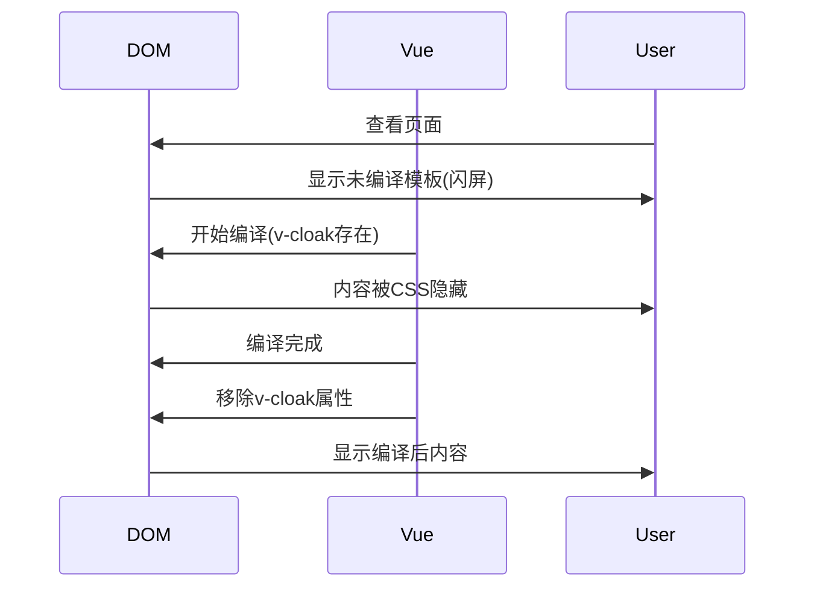

# 内置内容-指令

## Vue 内置指令 v-text 深度解析

### 1. v-text 基础概念
`v-text` 是 Vue 提供的一个内置指令，用于更新元素的 `textContent`。与 Mustache 语法（双大括号）类似，但更加高效且不会出现闪屏问题。

**基本用法示例：**
```vue
<template>
  <div>
    <!-- 传统插值语法 -->
    <p>{{ message }}</p>
    
    <!-- v-text 语法 -->
    <p v-text="message"></p>
  </div>
</template>

<script>
export default {
  data() {
    return {
      message: 'Hello Vue!'
    }
  }
}
</script>
```

### 2. 与插值语法的区别
- **编译时机**：v-text 在编译阶段处理，插值语法在运行时处理
- **内容替换**：v-text 完全替换元素内容，插值可以部分替换
- **性能**：v-text 性能略优，适合纯文本场景

### 3. 源码实现解析
在 Vue 源码中（src/platforms/web/runtime/directives/text.js）：

```javascript
export default {
  bind(el, binding) {
    el.textContent = binding.value
  },
  update(el, binding) {
    if (binding.value !== binding.oldValue) {
      el.textContent = binding.value
    }
  }
}
```

**关键点分析：**
1. `bind` 钩子在指令首次绑定到元素时调用
2. `update` 钩子在绑定值变化时调用
3. 通过直接操作 `textContent` 实现高效更新
4. 包含简单的值变化检查避免不必要的 DOM 操作

### 4. 高级用法示例
```vue
<template>
  <div>
    <!-- 动态内容 -->
    <div v-text="dynamicText"></div>
    
    <!-- 表达式计算 -->
    <div v-text="'Total: ' + (a + b)"></div>
    
    <!-- 方法返回值 -->
    <div v-text="getFullName()"></div>
  </div>
</template>

<script>
export default {
  data() {
    return {
      dynamicText: 'This is dynamic content',
      a: 10,
      b: 20,
      firstName: 'John',
      lastName: 'Doe'
    }
  },
  methods: {
    getFullName() {
      return `${this.firstName} ${this.lastName}`
    }
  }
}
</script>
```

### 5. 性能优化建议
1. 纯文本内容优先使用 v-text
2. 复杂内容使用插值或 v-html
3. 避免在 v-text 中使用复杂计算，可预先计算好
4. 静态内容直接写在模板中更高效

### 6. 可运行完整示例
```vue
<template>
  <div id="app">
    <h2>v-text 演示</h2>
    
    <!-- 基础用法 -->
    <p v-text="basicText"></p>
    
    <!-- 动态更新演示 -->
    <p v-text="counter"></p>
    <button @click="increment">增加计数器</button>
    
    <!-- 与插值语法对比 -->
    <div>
      <p>插值语法: {{ htmlContent }}</p>
      <p v-text="htmlContent"></p>
    </div>
  </div>
</template>

<script>
export default {
  name: 'App',
  data() {
    return {
      basicText: '这是通过 v-text 设置的文本内容',
      counter: 0,
      htmlContent: '<strong>这段内容不会被解析为HTML</strong>'
    }
  },
  methods: {
    increment() {
      this.counter++
    }
  }
}
</script>

<style>
#app {
  font-family: Avenir, Helvetica, Arial, sans-serif;
  padding: 20px;
}
button {
  margin-top: 10px;
  padding: 5px 10px;
}
</style>
```

### 7. 总结
`v-text` 是 Vue 提供的一个高效文本更新指令：
1. **本质**：操作 DOM 的 textContent 属性
2. **优势**：比插值语法更高效，避免闪屏问题
3. **局限**：会覆盖元素全部内容，不能解析 HTML
4. **适用场景**：纯文本内容更新，特别是频繁更新的内容
5. **实现原理**：通过指令钩子函数在绑定和更新时设置 textContent

记住：当需要完全替换元素文本内容时，`v-text` 是最佳选择；当需要保留部分静态内容或需要 HTML 解析时，应该使用插值语法或 `v-html`。

## Vue 内置指令 v-html 深度解析

### 1. v-html 基础概念
`v-html` 是 Vue 提供的用于设置元素 `innerHTML` 的内置指令，可以将字符串解析为 HTML 并插入到 DOM 中。与 `v-text` 不同，它会解析 HTML 标签。

**基本用法示例：**
```vue
<template>
  <div>
    <!-- 普通文本渲染 -->
    <div>{{ rawHtml }}</div>
    
    <!-- HTML 渲染 -->
    <div v-html="rawHtml"></div>
  </div>
</template>

<script>
export default {
  data() {
    return {
      rawHtml: '<span style="color: red">红色文字</span>'
    }
  }
}
</script>
```

### 2. 安全注意事项
使用 `v-html` 需要特别注意 XSS 攻击风险：
- 永远不要使用用户提供的内容作为 `v-html` 的值
- 需要渲染用户内容时应该先进行转义或净化
- 尽量使用更安全的替代方案

### 3. 源码实现解析
在 Vue 源码中（src/platforms/web/runtime/directives/html.js）：

```javascript
export default {
  bind(el, binding) {
    el.innerHTML = binding.value
  },
  update(el, binding) {
    if (binding.value !== binding.oldValue) {
      el.innerHTML = binding.value
    }
  }
}
```

**关键点分析：**
1. `bind` 钩子初始化时设置 `innerHTML`
2. `update` 钩子在值变化时更新 `innerHTML`
3. 通过比较新旧值避免不必要的 DOM 操作
4. 没有内置的 XSS 防护，需要开发者自行处理

### 4. 高级用法示例
```vue
<template>
  <div>
    <!-- 动态 HTML 内容 -->
    <div v-html="dynamicHtml"></div>
    
    <!-- 组合多个 HTML 片段 -->
    <div v-html="headerHtml + contentHtml + footerHtml"></div>
    
    <!-- 从方法获取 HTML -->
    <div v-html="getFormattedHtml()"></div>
  </div>
</template>

<script>
export default {
  data() {
    return {
      dynamicHtml: '<div class="alert">动态内容</div>',
      headerHtml: '<header>页眉</header>',
      contentHtml: '<main>主要内容</main>',
      footerHtml: '<footer>页脚</footer>'
    }
  },
  methods: {
    getFormattedHtml() {
      return `<div style="border: 1px solid #ccc; padding: 10px;">
                ${new Date().toLocaleString()}
              </div>`
    }
  }
}
</script>
```

### 5. 性能与安全最佳实践
1. **缓存 HTML 字符串**：避免频繁生成 HTML
2. **使用 DOMPurify**：净化用户输入的 HTML
3. **限制使用范围**：只在必要时使用 v-html
4. **配合组件使用**：复杂内容封装为组件更安全

### 6. 可运行完整示例
```vue
<template>
  <div id="app">
    <h2>v-html 演示</h2>
    
    <!-- 基础用法 -->
    <div v-html="safeHtml"></div>
    
    <!-- 动态内容 -->
    <div v-html="dynamicContent"></div>
    <button @click="changeContent">更改内容</button>
    
    <!-- 安全警示 -->
    <div class="warning">
      <h3>危险示例（请勿在实际项目中使用）</h3>
      <input v-model="userInput" placeholder="输入HTML">
      <button @click="showUserHtml">显示</button>
      <div v-html="unsafeHtml"></div>
    </div>
  </div>
</template>

<script>
export default {
  name: 'App',
  data() {
    return {
      safeHtml: '<p>这是<strong>安全</strong>的HTML内容</p>',
      dynamicContent: '<div style="background: #eee; padding: 10px;">初始内容</div>',
      userInput: '',
      unsafeHtml: ''
    }
  },
  methods: {
    changeContent() {
      this.dynamicContent = `<div style="background: #${Math.floor(Math.random()*16777215).toString(16)}; padding: 10px; color: white;">
        更新于 ${new Date().toLocaleTimeString()}
      </div>`
    },
    showUserHtml() {
      // 警告：实际项目中应该使用DOMPurify等库净化
      this.unsafeHtml = this.userInput
    }
  }
}
</script>

<style>
#app {
  font-family: Avenir, Helvetica, Arial, sans-serif;
  padding: 20px;
}
button {
  margin: 10px 5px 10px 0;
  padding: 5px 10px;
}
.warning {
  border: 2px solid red;
  padding: 10px;
  margin-top: 20px;
}
input {
  padding: 5px;
  width: 300px;
}
</style>
```

### 7. 总结
`v-html` 是 Vue 提供的强大但需要谨慎使用的指令：
1. **核心功能**：将字符串作为 HTML 解析并插入到 DOM
2. **实现原理**：通过操作元素的 innerHTML 属性
3. **优势**：可以渲染富文本和动态 HTML 结构
4. **风险**：存在 XSS 攻击隐患，必须谨慎处理用户输入
5. **适用场景**：渲染可信的、预定义的 HTML 内容
6. **替代方案**：复杂内容建议使用组件或渲染函数

记住：`v-html` 就像一把锋利的刀，功能强大但使用不当会造成伤害。在必须使用时，确保内容来源可信或经过适当净化。对于大多数情况，使用组件或模板语法是更安全的选择。

## Vue 内置指令 v-show 深度解析

### 1. v-show 基础概念
`v-show` 是 Vue 提供的用于条件性显示元素的指令，通过控制 CSS 的 `display` 属性来实现显示/隐藏切换。

**基本用法示例：**
```vue
<template>
  <div>
    <!-- 条件显示 -->
    <div v-show="isVisible">我会根据条件显示/隐藏</div>
    
    <!-- 与 v-if 对比 -->
    <div v-if="isVisible">我是 v-if 控制的元素</div>
  </div>
</template>

<script>
export default {
  data() {
    return {
      isVisible: true
    }
  }
}
</script>
```

### 2. 与 v-if 的核心区别
| 特性         | v-show               | v-if                |
| ------------ | -------------------- | ------------------- |
| **DOM 存在** | 始终存在             | 条件为 false 时移除 |
| **切换开销** | 高（CSS 切换）       | 低（DOM 操作）      |
| **初始渲染** | 无论条件如何都会渲染 | 条件为 true 才渲染  |
| **适用场景** | 频繁切换的场景       | 运行时条件很少改变  |

### 3. 源码实现解析
在 Vue 源码中（src/platforms/web/runtime/directives/show.js）：

```javascript
export default {
  bind(el, { value }, vnode) {
    const originalDisplay = el.style.display
    el._v_original_display = originalDisplay === 'none' ? '' : originalDisplay
    setDisplay(el, value)
  },
  update(el, { value, oldValue }) {
    if (value !== oldValue) {
      setDisplay(el, value)
    }
  }
}

function setDisplay(el, value) {
  el.style.display = value ? el._v_original_display : 'none'
}
```

**关键点分析：**
1. `bind` 钩子保存元素原始 display 值
2. `update` 钩子在值变化时更新 display
3. 通过样式切换而非 DOM 操作实现显示/隐藏
4. 保留了元素原始 display 值（block/inline-block/flex 等）

### 4. 高级用法示例
```vue
<template>
  <div>
    <!-- 动态计算显示条件 -->
    <div v-show="items.length > 0">
      列表中有 {{ items.length }} 项
    </div>
    
    <!-- 结合计算属性 -->
    <div v-show="shouldShow">
      基于复杂逻辑显示的内容
    </div>
    
    <!-- 多条件判断 -->
    <div v-show="isActive && hasPermission">
      需要同时满足两个条件
    </div>
  </div>
</template>

<script>
export default {
  data() {
    return {
      items: [1, 2, 3],
      isActive: true,
      hasPermission: true
    }
  },
  computed: {
    shouldShow() {
      return this.items.length > 0 && this.isActive
    }
  }
}
</script>
```

### 5. 性能优化建议
1. **频繁切换用 v-show**：如选项卡、折叠面板等
2. **初始不显示用 v-if**：减少初始 DOM 节点数量
3. **避免嵌套过深**：多层 v-show 会增加样式计算开销
4. **配合 transition 使用**：实现平滑的显示/隐藏动画

### 6. 可运行完整示例
```vue
<template>
  <div id="app">
    <h2>v-show 演示</h2>
    
    <!-- 基础演示 -->
    <div class="demo-box" v-show="showBox1">
      盒子1内容（v-show控制）
    </div>
    <button @click="toggleBox1">切换盒子1</button>
    
    <!-- 与v-if对比 -->
    <div class="demo-box" v-if="showBox2">
      盒子2内容（v-if控制）
    </div>
    <button @click="toggleBox2">切换盒子2</button>
    
    <!-- 性能对比 -->
    <div class="performance-test">
      <h3>性能测试（打开控制台查看）</h3>
      <button @click="startToggle('show')">频繁切换v-show</button>
      <button @click="startToggle('if')">频繁切换v-if</button>
      <button @click="stopToggle">停止</button>
      
      <div v-show="toggleState.show" class="test-box">v-show测试</div>
      <div v-if="toggleState.if" class="test-box">v-if测试</div>
    </div>
  </div>
</template>

<script>
export default {
  name: 'App',
  data() {
    return {
      showBox1: true,
      showBox2: true,
      toggleState: {
        show: true,
        if: true
      },
      toggleInterval: null
    }
  },
  methods: {
    toggleBox1() {
      this.showBox1 = !this.showBox1
      console.log('DOM 始终存在:', document.querySelector('.demo-box'))
    },
    toggleBox2() {
      this.showBox2 = !this.showBox2
      setTimeout(() => {
        console.log('DOM 状态:', document.querySelectorAll('.demo-box').length)
      }, 0)
    },
    startToggle(type) {
      this.stopToggle()
      this.toggleInterval = setInterval(() => {
        this.toggleState[type] = !this.toggleState[type]
      }, 10)
    },
    stopToggle() {
      clearInterval(this.toggleInterval)
    }
  },
  beforeDestroy() {
    this.stopToggle()
  }
}
</script>

<style>
#app {
  font-family: Avenir, Helvetica, Arial, sans-serif;
  padding: 20px;
}
button {
  margin: 10px 5px 10px 0;
  padding: 5px 10px;
}
.demo-box {
  width: 200px;
  height: 100px;
  background: #f0f0f0;
  margin: 10px 0;
  padding: 10px;
  border: 1px solid #ddd;
}
.performance-test {
  margin-top: 30px;
  padding: 15px;
  background: #f9f9f9;
  border: 1px solid #eee;
}
.test-box {
  width: 100px;
  height: 50px;
  background: #eef;
  margin: 5px 0;
  padding: 5px;
}
</style>
```

### 7. 总结
`v-show` 是 Vue 中实现条件显示的高效指令：
1. **核心机制**：通过 CSS display 属性控制元素可见性
2. **性能特点**：适合频繁切换的场景，但初始渲染成本固定
3. **与 v-if 区别**：不销毁组件实例，只是视觉上隐藏
4. **实现原理**：保存原始 display 值，切换时修改样式
5. **最佳实践**：
   - 频繁切换（>1次/秒）用 v-show
   - 初始不显示且很少切换用 v-if
   - 需要过渡动画时 v-show 更合适

记住：`v-show` 就像给元素戴了顶隐形帽子，虽然看不见但人还在那里；而 `v-if` 则是让人直接离开房间。根据场景选择合适的指令，才能获得最佳性能。

## Vue 内置指令 v-if 深度解析

### 1. v-if 基础概念
`v-if` 是 Vue 提供的用于条件性渲染元素的指令，它会根据表达式的真假值在 DOM 中创建或销毁元素及其子组件。

**基本用法示例：**
```vue
<template>
  <div>
    <!-- 条件渲染 -->
    <div v-if="isVisible">我会根据条件存在或消失</div>
    
    <!-- 配套指令 -->
    <div v-if="score >= 90">优秀</div>
    <div v-else-if="score >= 60">及格</div>
    <div v-else>不及格</div>
  </div>
</template>

<script>
export default {
  data() {
    return {
      isVisible: true,
      score: 85
    }
  }
}
</script>
```

### 2. 与 v-show 的核心区别
| 特性         | v-if                | v-show               |
| ------------ | ------------------- | -------------------- |
| **DOM 操作** | 条件为 false 时移除 | 始终存在，仅修改样式 |
| **初始开销** | 条件为 true 才渲染  | 无论条件如何都会渲染 |
| **切换开销** | 高（DOM 操作）      | 低（CSS 切换）       |
| **适用场景** | 运行时条件很少改变  | 频繁切换的场景       |

### 3. 源码实现解析
在 Vue 源码中（src/compiler/parser/index.js 和 runtime/directives/if.js）：

```javascript
// 编译阶段生成条件渲染代码
function processIf(el) {
  const exp = getAndRemoveAttr(el, 'v-if')
  if (exp) {
    el.if = exp
    addIfCondition(el, {
      exp: exp,
      block: el
    })
  }
}

// 运行时实现
export default {
  bind(el, binding, vnode) {
    const vm = vnode.context
    const result = binding.value
    const comment = document.createComment(' ')
    
    if (!result) {
      vm.$el.replaceChild(comment, el)
    }
  },
  update(el, binding, vnode) {
    const vm = vnode.context
    const result = binding.value
    
    if (result) {
      // 插入DOM
      vm.$el.insertBefore(el, comment)
    } else {
      // 移除DOM
      vm.$el.replaceChild(comment, el)
    }
  }
}
```

**关键点分析：**
1. **编译阶段**：解析模板时处理 v-if 指令并生成条件代码
2. **运行时**：根据条件值动态添加/移除 DOM 节点
3. **使用注释节点**：作为占位符保持 DOM 结构稳定
4. **组件生命周期**：条件变化会触发组件的创建/销毁钩子

### 4. 高级用法示例
```vue
<template>
  <div>
    <!-- 动态组件切换 -->
    <component :is="currentComponent" v-if="showComponent"></component>
    
    <!-- 模板复用 -->
    <template v-if="layout === 'A'">
      <HeaderA />
      <ContentA />
    </template>
    <template v-else>
      <HeaderB />
      <ContentB />
    </template>
    
    <!-- 结合计算属性 -->
    <div v-if="shouldRender">
      基于复杂逻辑渲染的内容
    </div>
  </div>
</template>

<script>
export default {
  data() {
    return {
      showComponent: true,
      currentComponent: 'ComponentA',
      layout: 'A'
    }
  },
  computed: {
    shouldRender() {
      return this.layout === 'A' && this.showComponent
    }
  }
}
</script>
```

### 5. 性能优化建议
1. **减少不必要的条件变化**：避免频繁切换 v-if
2. **合理使用 key**：相同元素类型切换时添加 key
3. **惰性渲染**：初始不显示的内容使用 v-if
4. **避免深层嵌套**：多层 v-if 会增加渲染成本

### 6. 可运行完整示例
```vue
<template>
  <div id="app">
    <h2>v-if 演示</h2>
    
    <!-- 基础演示 -->
    <div class="demo-box" v-if="showBox">
      我是v-if控制的盒子
    </div>
    <button @click="toggleBox">切换盒子显示</button>
    
    <!-- 条件分支 -->
    <div class="score-box">
      <input v-model.number="score" type="number" placeholder="输入分数">
      <div v-if="score >= 90" class="score-result excellent">优秀</div>
      <div v-else-if="score >= 80" class="score-result good">良好</div>
      <div v-else-if="score >= 60" class="score-result pass">及格</div>
      <div v-else class="score-result fail">不及格</div>
    </div>
    
    <!-- 性能测试 -->
    <div class="performance-test">
      <h3>组件生命周期测试</h3>
      <button @click="toggleComponent">切换组件</button>
      <ChildComponent v-if="showChild" :key="componentKey" />
    </div>
  </div>
</template>

<script>
const ChildComponent = {
  template: '<div class="child">子组件 ({{ count }})</div>',
  data() {
    return { count: 0 }
  },
  created() {
    console.log('子组件 created')
    this.timer = setInterval(() => {
      this.count++
    }, 1000)
  },
  destroyed() {
    console.log('子组件 destroyed')
    clearInterval(this.timer)
  }
}

export default {
  name: 'App',
  components: { ChildComponent },
  data() {
    return {
      showBox: true,
      score: 0,
      showChild: true,
      componentKey: 0
    }
  },
  methods: {
    toggleBox() {
      this.showBox = !this.showBox
      console.log('DOM 状态:', document.querySelectorAll('.demo-box').length)
    },
    toggleComponent() {
      this.showChild = !this.showChild
      if (this.showChild) {
        this.componentKey++ // 强制重新创建组件
      }
    }
  }
}
</script>

<style>
#app {
  font-family: Avenir, Helvetica, Arial, sans-serif;
  padding: 20px;
}
button {
  margin: 10px 5px 10px 0;
  padding: 5px 10px;
}
.demo-box {
  width: 200px;
  height: 100px;
  background: #f0f0f0;
  margin: 10px 0;
  padding: 10px;
  border: 1px solid #ddd;
}
.score-box {
  margin: 20px 0;
}
input {
  padding: 5px;
  width: 100px;
}
.score-result {
  margin: 10px 0;
  padding: 10px;
  width: 200px;
}
.excellent { background: #a5d6a7; }
.good { background: #fff59d; }
.pass { background: #b0bec5; }
.fail { background: #ef9a9a; }
.performance-test {
  margin-top: 30px;
  padding: 15px;
  background: #f9f9f9;
  border: 1px solid #eee;
}
.child {
  padding: 10px;
  background: #e3f2fd;
  margin: 10px 0;
}
</style>
```

### 7. 总结
`v-if` 是 Vue 中实现条件渲染的核心指令：
1. **核心机制**：通过 DOM 的添加/移除实现条件渲染
2. **组件生命周期**：条件变化会触发组件的创建/销毁
3. **性能特点**：初始渲染成本低，但切换开销较大
4. **实现原理**：
   - 编译阶段生成条件代码
   - 运行时使用注释节点占位
   - 根据条件动态操作 DOM
5. **最佳实践**：
   - 初始不显示的内容优先使用 v-if
   - 需要完整生命周期控制时使用 v-if
   - 频繁切换的场景避免使用 v-if
   - 配合 key 属性优化组件复用

记住：`v-if` 就像建筑工地的施工队，会根据设计图（条件）决定是否建造（渲染）某栋建筑（元素）；而 `v-show` 更像是给建筑装上可开关的窗帘。选择合适的指令，才能构建出高效、可维护的 Vue 应用。

## Vue 内置指令 v-else 深度解析

### 1. v-else 基础概念
`v-else` 是 Vue 提供的与 `v-if` 或 `v-else-if` 配套使用的指令，用于表示一个条件分支的"否则"情况。它必须紧跟在 `v-if` 或 `v-else-if` 元素之后。

**基本用法示例：**
```vue
<template>
  <div>
    <!-- 基本条件分支 -->
    <div v-if="isAdmin">管理员面板</div>
    <div v-else>普通用户面板</div>
    
    <!-- 多条件分支 -->
    <div v-if="score >= 90">优秀</div>
    <div v-else-if="score >= 60">及格</div>
    <div v-else>不及格</div>
  </div>
</template>

<script>
export default {
  data() {
    return {
      isAdmin: false,
      score: 75
    }
  }
}
</script>
```

### 2. 核心特性解析
1. **无表达式**：v-else 不接受任何表达式
2. **相邻要求**：必须紧跟在 v-if 或 v-else-if 元素之后
3. **DOM 操作**：与 v-if 相同，会实际添加/移除 DOM
4. **键控复用**：相同类型的元素建议添加 key 避免复用

### 3. 源码实现解析
在 Vue 源码中（src/compiler/parser/index.js）：

```javascript
function processIfConditions(el, parent) {
  const prev = findPrevElement(parent.children)
  if (prev && prev.if) {
    addIfCondition(prev, {
      exp: 'true', // v-else 相当于 true
      block: el
    })
    el.else = true
  }
}

function findPrevElement(children) {
  let i = children.length
  while (i--) {
    if (children[i].type === 1) {
      return children[i]
    }
  }
}
```

**关键点分析：**
1. **编译阶段**：解析模板时处理 v-else 指令
2. **关联前驱**：找到前一个 v-if 或 v-else-if 元素
3. **条件构建**：为前驱元素添加条件分支
4. **标记处理**：标记当前元素为 else 分支

### 4. 高级用法示例
```vue
<template>
  <div>
    <!-- 模板复用 -->
    <template v-if="layout === 'A'">
      <HeaderA />
      <ContentA />
    </template>
    <template v-else>
      <HeaderB />
      <ContentB />
    </template>
    
    <!-- 动态组件 -->
    <component
      v-if="currentView === 'A'"
      :is="ComponentA"
    />
    <component
      v-else
      :is="ComponentB"
    />
    
    <!-- 结合 v-show -->
    <div v-if="loading">加载中...</div>
    <div v-else v-show="hasContent">
      内容加载完成: {{ content }}
    </div>
  </div>
</template>

<script>
export default {
  data() {
    return {
      layout: 'A',
      currentView: 'A',
      loading: true,
      hasContent: false,
      content: ''
    }
  },
  mounted() {
    setTimeout(() => {
      this.loading = false
      this.hasContent = true
      this.content = '这是异步加载的内容'
    }, 2000)
  }
}
</script>
```

### 5. 常见问题与解决方案
1. **元素类型相同**：添加 key 避免不合理的复用
2. **多元素分组**：使用 template 标签包裹
3. **意外空白**：注意 HTML 中的空白文本节点
4. **动态组件**：配合 keep-alive 保持状态

### 6. 可运行完整示例
```vue
<template>
  <div id="app">
    <h2>v-else 演示</h2>
    
    <!-- 基础演示 -->
    <div class="auth-box">
      <button @click="toggleAuth">切换身份</button>
      <div v-if="isAdmin" class="admin-panel">
        <h3>管理员控制台</h3>
        <p>您可以管理用户和系统设置</p>
      </div>
      <div v-else class="user-panel">
        <h3>用户面板</h3>
        <p>欢迎使用系统</p>
      </div>
    </div>
    
    <!-- 多条件分支 -->
    <div class="grade-box">
      <h3>成绩评定</h3>
      <input v-model.number="score" type="number" placeholder="输入分数">
      <div v-if="score >= 90" class="grade excellent">优秀</div>
      <div v-else-if="score >= 80" class="grade good">良好</div>
      <div v-else-if="score >= 60" class="grade pass">及格</div>
      <div v-else class="grade fail">不及格</div>
    </div>
    
    <!-- 元素复用问题演示 -->
    <div class="reuse-demo">
      <h3>元素复用问题</h3>
      <button @click="toggleType">切换类型</button>
      <div v-if="showTypeA" class="demo-item">
        <label>类型A:</label>
        <input placeholder="输入A类型数据">
      </div>
      <div v-else class="demo-item">
        <label>类型B:</label>
        <input placeholder="输入B类型数据">
      </div>
      
      <p>问题：切换时输入框内容会保留</p>
      <p>解决方案：添加 key 属性</p>
      
      <div v-if="showTypeA" class="demo-item" key="typeA">
        <label>类型A:</label>
        <input placeholder="输入A类型数据">
      </div>
      <div v-else class="demo-item" key="typeB">
        <label>类型B:</label>
        <input placeholder="输入B类型数据">
      </div>
    </div>
  </div>
</template>

<script>
export default {
  name: 'App',
  data() {
    return {
      isAdmin: false,
      score: 0,
      showTypeA: true
    }
  },
  methods: {
    toggleAuth() {
      this.isAdmin = !this.isAdmin
    },
    toggleType() {
      this.showTypeA = !this.showTypeA
    }
  }
}
</script>

<style>
#app {
  font-family: Avenir, Helvetica, Arial, sans-serif;
  padding: 20px;
}
button {
  margin: 10px 5px 10px 0;
  padding: 5px 10px;
}
.auth-box, .grade-box, .reuse-demo {
  margin: 20px 0;
  padding: 15px;
  border: 1px solid #eee;
  border-radius: 4px;
}
.admin-panel {
  background: #ffebee;
  padding: 10px;
}
.user-panel {
  background: #e8f5e9;
  padding: 10px;
}
input[type="number"] {
  padding: 5px;
  width: 100px;
}
.grade {
  padding: 10px;
  margin: 10px 0;
  width: 200px;
}
.excellent { background: #a5d6a7; }
.good { background: #fff59d; }
.pass { background: #b0bec5; }
.fail { background: #ef9a9a; }
.demo-item {
  margin: 10px 0;
  padding: 10px;
  background: #f5f5f5;
}
.demo-item input {
  margin-left: 10px;
  padding: 5px;
  width: 200px;
}
</style>
```

### 7. 总结
`v-else` 是 Vue 条件渲染体系中的重要组成部分：
1. **核心功能**：作为 v-if/v-else-if 的默认分支
2. **语法要求**：必须紧跟前置条件指令，不接受表达式
3. **实现原理**：
   - 编译阶段关联前驱条件元素
   - 运行时作为条件分支的一部分处理
   - 与前驱条件共享条件判断逻辑
4. **最佳实践**：
   - 多分支逻辑使用 v-if/v-else-if/v-else 链
   - 相同元素类型添加 key 避免复用问题
   - 复杂分支使用 template 标签分组
   - 注意与 v-show 的适用场景区别

记住：`v-else` 就像编程语言中的 else 语句，为条件逻辑提供了完整的表达能力。合理使用可以使模板更加清晰，但要特别注意元素复用和性能影响。在需要"非此即彼"的渲染逻辑时，v-else 是最简洁直观的选择。

## Vue 3 内置指令 v-for 深度解析

### 1. v-for 基础概念
`v-for` 是 Vue 提供的用于循环渲染元素的指令，支持遍历数组、对象和数字范围。

**Vue 3 基本用法示例：**
```vue
<template>
  <div>
    <!-- 遍历数组 -->
    <ul>
      <li v-for="(item, index) in items" :key="item.id">
        {{ index }}. {{ item.name }}
      </li>
    </ul>
    
    <!-- 遍历对象 -->
    <div v-for="(value, key) in userInfo" :key="key">
      {{ key }}: {{ value }}
    </div>
    
    <!-- 遍历数字 -->
    <span v-for="n in 5" :key="n">{{ n }}</span>
  </div>
</template>

<script setup>
const items = ref([
  { id: 1, name: 'Item A' },
  { id: 2, name: 'Item B' }
])

const userInfo = ref({
  name: 'John',
  age: 30,
  job: 'Developer'
})
</script>
```

### 2. Vue 3 新特性
1. **Fragment 支持**：v-for 可以直接用在 template 上
2. **性能优化**：更高效的 diff 算法
3. **组合式 API**：与 ref/reactive 完美配合
4. **类型推断**：更好的 TypeScript 支持

### 3. 源码实现解析
Vue 3 的 v-for 实现主要在 `packages/runtime-core/src/helpers/renderList.ts`：

```typescript
export function renderList(
  source: any,
  renderItem: (value: any, key: string | number, index: number) => VNode
): VNode[] {
  let ret: VNode[] = []
  
  if (isArray(source) || isString(source)) {
    for (let i = 0; i < source.length; i++) {
      ret.push(renderItem(source[i], i, i))
    }
  } else if (typeof source === 'number') {
    for (let i = 0; i < source; i++) {
      ret.push(renderItem(i + 1, i, i))
    }
  } else if (isObject(source)) {
    const keys = Object.keys(source)
    for (let i = 0; i < keys.length; i++) {
      const key = keys[i]
      ret.push(renderItem(source[key], key, i))
    }
  }
  
  return ret
}
```

**关键点分析：**
1. **多类型处理**：统一处理数组、对象、数字和字符串
2. **高效渲染**：返回 VNode 数组供渲染函数使用
3. **响应式集成**：自动追踪依赖，数据变化时高效更新
4. **Fragment 支持**：允许返回多个根节点

### 4. 高级用法示例
```vue
<template>
  <!-- 嵌套循环 -->
  <div v-for="category in categories" :key="category.id">
    <h3>{{ category.name }}</h3>
    <ul>
      <li v-for="product in category.products" :key="product.id">
        {{ product.name }} - \${{ product.price }}
      </li>
    </ul>
  </div>

  <!-- 结合 v-if -->
  <template v-for="item in filteredItems" :key="item.id">
    <div v-if="item.isActive">{{ item.name }}</div>
  </template>

  <!-- 使用解构 -->
  <li v-for="{ id, name } in users" :key="id">
    {{ name }}
  </li>
</template>

<script setup>
import { computed } from 'vue'

const categories = ref([
  {
    id: 1,
    name: 'Electronics',
    products: [
      { id: 101, name: 'Laptop', price: 999 },
      { id: 102, name: 'Phone', price: 699 }
    ]
  }
])

const items = ref([
  { id: 1, name: 'Item A', isActive: true },
  { id: 2, name: 'Item B', isActive: false }
])

const filteredItems = computed(() => 
  items.value.filter(item => item.isActive)
)
</script>
```

### 5. 性能优化指南
1. **始终使用 key**：推荐使用唯一 ID 而非 index
2. **避免 v-for 与 v-if 同元素**：先用 computed 过滤数据
3. **减少嵌套层级**：扁平化数据结构
4. **大型列表优化**：考虑虚拟滚动（如 vue-virtual-scroller）

### 6. 可运行完整示例
```vue
<template>
  <div class="container">
    <h2>商品列表</h2>
    
    <!-- 基本列表 -->
    <div class="toolbar">
      <button @click="addItem">添加商品</button>
      <button @click="shuffle">随机排序</button>
      <input v-model="search" placeholder="搜索商品">
    </div>
    
    <ul class="item-list">
      <li 
        v-for="item in filteredItems" 
        :key="item.id"
        class="item"
      >
        <span>{{ item.name }}</span>
        <span>\${{ item.price }}</span>
        <button @click="removeItem(item.id)">删除</button>
      </li>
    </ul>
    
    <!-- 购物车 -->
    <h3>购物车 ({{ cart.length }})</h3>
    <transition-group name="cart" tag="ul" class="cart">
      <li v-for="item in cart" :key="item.id" class="cart-item">
        {{ item.name }} × {{ item.quantity }}
        <button @click="decrease(item.id)">-</button>
        <button @click="increase(item.id)">+</button>
      </li>
    </transition-group>
    
    <!-- 状态展示 -->
    <div class="debug-info">
      <h4>调试信息</h4>
      <p>原始数据: {{ items.length }} 条</p>
      <p>过滤后: {{ filteredItems.length }} 条</p>
      <p>购物车总数: {{ totalQuantity }} 件</p>
      <p>总金额: \${{ totalPrice }}</p>
    </div>
  </div>
</template>

<script setup>
import { ref, computed } from 'vue'

// 商品数据
const items = ref([
  { id: 1, name: '笔记本电脑', price: 899 },
  { id: 2, name: '智能手机', price: 699 },
  { id: 3, name: '平板电脑', price: 499 },
  { id: 4, name: '智能手表', price: 199 },
  { id: 5, name: '无线耳机', price: 149 }
])

// 购物车
const cart = ref([])

// 搜索功能
const search = ref('')

// 计算属性
const filteredItems = computed(() => {
  return items.value.filter(item => 
    item.name.includes(search.value)
  )
})

const totalQuantity = computed(() => {
  return cart.value.reduce((sum, item) => sum + item.quantity, 0)
})

const totalPrice = computed(() => {
  return cart.value.reduce((sum, item) => {
    const product = items.value.find(p => p.id === item.id)
    return sum + (product.price * item.quantity)
  }, 0)
})

// 方法
function addItem() {
  const id = Date.now()
  items.value.push({
    id,
    name: `新产品 ${items.value.length + 1}`,
    price: Math.round(Math.random() * 500 + 100)
  })
}

function removeItem(id) {
  items.value = items.value.filter(item => item.id !== id)
  cart.value = cart.value.filter(item => item.id !== id)
}

function shuffle() {
  items.value = [...items.value].sort(() => Math.random() - 0.5)
}

function increase(id) {
  const item = cart.value.find(item => item.id === id)
  if (item) {
    item.quantity++
  } else {
    cart.value.push({ id, quantity: 1 })
  }
}

function decrease(id) {
  const index = cart.value.findIndex(item => item.id === id)
  if (index !== -1) {
    if (cart.value[index].quantity > 1) {
      cart.value[index].quantity--
    } else {
      cart.value.splice(index, 1)
    }
  }
}
</script>

<style>
.container {
  max-width: 800px;
  margin: 0 auto;
  padding: 20px;
  font-family: Arial, sans-serif;
}

.toolbar {
  margin: 20px 0;
}

.toolbar button {
  margin-right: 10px;
  padding: 5px 10px;
}

.item-list {
  list-style: none;
  padding: 0;
}

.item {
  display: flex;
  justify-content: space-between;
  padding: 10px;
  border-bottom: 1px solid #eee;
}

.cart {
  list-style: none;
  padding: 0;
}

.cart-item {
  padding: 5px 10px;
  margin: 5px 0;
  background: #f5f5f5;
  display: flex;
  align-items: center;
}

.cart-item button {
  margin: 0 5px;
  width: 25px;
}

.debug-info {
  margin-top: 30px;
  padding: 15px;
  background: #f9f9f9;
  border: 1px solid #ddd;
}

/* 过渡动画 */
.cart-move {
  transition: transform 0.5s ease;
}
</style>
```

### 7. 总结
Vue 3 的 `v-for` 指令在保留核心功能的同时进行了多项优化：
1. **核心机制**：高效渲染列表数据，自动追踪响应式依赖
2. **新特性**：支持 Fragment、更好的类型推断和组合式 API 集成
3. **性能关键**：
   - 必须为每项提供唯一 key
   - 避免与 v-if 同时使用
   - 大数据集考虑虚拟滚动
4. **实现原理**：
   - 编译阶段转换为渲染函数
   - 运行时根据数据类型生成 VNodes
   - 智能 diff 算法最小化 DOM 操作
5. **最佳实践**：
   - 简单列表直接使用 v-for
   - 复杂场景结合 computed 预处理数据
   - 动态列表注意状态保持
   - 嵌套数据考虑扁平化优化

记住：`v-for` 就像复印机，可以高效复制模板，但每份复印件（元素）都需要唯一的条形码（key）来识别。合理使用能让你的应用既高效又易于维护。


## Vue 3 内置指令 v-on 深度解析

### 1. v-on 基础概念
`v-on` 是 Vue 提供的用于绑定事件监听器的指令，可以简写为 `@` 符号。Vue 3 对其进行了多项优化，包括更好的类型支持和更灵活的事件处理。

**Vue 3 基本用法示例：**
```vue
<template>
  <div>
    <!-- 基础事件绑定 -->
    <button v-on:click="handleClick">点击我</button>
    
    <!-- 简写形式 -->
    <button @click="handleClick">简写点击</button>
    
    <!-- 内联表达式 -->
    <button @click="count++">计数: {{ count }}</button>
    
    <!-- 多事件处理器 -->
    <button @click="firstHandler(); secondHandler()">多事件</button>
  </div>
</template>

<script setup>
import { ref } from 'vue'

const count = ref(0)

function handleClick() {
  alert('按钮被点击!')
}

function firstHandler() {
  console.log('第一个处理器')
}

function secondHandler() {
  console.log('第二个处理器')
}
</script>
```

### 2. Vue 3 新特性
1. **事件修饰符链式调用**：支持 `@click.stop.prevent`
2. **多个 v-on 绑定**：同一事件可绑定多个处理器
3. **更好的 TypeScript 支持**：事件类型推断
4. **组件 emits 类型定义**：更严格的组件事件验证

### 3. 源码实现解析
Vue 3 的 v-on 实现主要在 `packages/runtime-dom/src/modules/events.ts`：

```typescript
export function patchEvent(
  el: Element,
  rawName: string,
  prevValue: EventValue | null,
  nextValue: EventValue | null
) {
  // 处理修饰符
  const name = parseName(rawName)
  
  // 移除旧监听器
  if (prevValue) {
    el.removeEventListener(name, prevValue)
  }
  
  // 添加新监听器
  if (nextValue) {
    el.addEventListener(name, nextValue, {
      passive: name === 'scroll' // 自动优化滚动事件
    })
  }
}

function parseName(name: string): string {
  // 处理修饰符如 .stop .prevent
  return name.replace(/\.(stop|prevent|self|capture|passive|once)/g, '')
}
```

**关键点分析：**
1. **事件缓存**：利用闭包缓存事件处理器
2. **修饰符处理**：编译阶段转换修饰符为等效代码
3. **性能优化**：自动为滚动事件添加 passive 选项
4. **动态更新**：事件变化时自动移除旧监听器

### 4. 高级用法示例
```vue
<template>
  <!-- 事件修饰符 -->
  <form @submit.prevent="onSubmit">
    <input @keyup.enter="submitForm">
    <a @click.stop.prevent="doSomething">链接</a>
  </form>

  <!-- 动态事件 -->
  <button @[dynamicEvent]="handler">动态事件</button>

  <!-- 组件自定义事件 -->
  <ChildComponent @custom-event="handleCustomEvent" />

  <!-- 对象语法 -->
  <button v-on="{ click: onClick, mouseover: onMouseOver }">对象语法</button>
</template>

<script setup>
import { ref } from 'vue'
import ChildComponent from './ChildComponent.vue'

const dynamicEvent = ref('click')

function onSubmit() {
  console.log('表单提交阻止了默认行为')
}

function submitForm() {
  console.log('Enter键触发提交')
}

function doSomething() {
  console.log('阻止了冒泡和默认行为')
}

function handler() {
  console.log('动态事件处理')
}

function handleCustomEvent(data) {
  console.log('收到子组件事件:', data)
}

function onClick() {
  console.log('点击事件')
}

function onMouseOver() {
  console.log('鼠标悬停')
}
</script>
```

### 5. 事件修饰符详解
1. **.stop**：调用 `event.stopPropagation()`
2. **.prevent**：调用 `event.preventDefault()`
3. **.capture**：使用捕获模式
4. **.self**：仅当事件从元素本身触发时调用
5. **.once**：只触发一次
6. **.passive**：改善滚动性能
7. **.native**（Vue 3 已移除）：直接监听原生事件

### 6. 可运行完整示例
```vue
<template>
  <div class="event-demo">
    <h2>事件演示</h2>
    
    <!-- 基础事件 -->
    <div class="demo-section">
      <h3>基础事件绑定</h3>
      <button @click="increment">计数器: {{ count }}</button>
      <button @click.right="rightClick">右键点击我</button>
    </div>
    
    <!-- 事件修饰符 -->
    <div class="demo-section">
      <h3>事件修饰符</h3>
      <div @click="log('div clicked')" class="modifier-box">
        <button @click.stop="log('button clicked')">.stop 阻止冒泡</button>
      </div>
      
      <form @submit.prevent="log('表单提交阻止了默认行为')">
        <input type="submit" value=".prevent 表单提交">
      </form>
      
      <a href="https://vuejs.org" 
         @click.prevent="log('阻止了链接跳转')">
        .prevent 阻止默认行为
      </a>
    </div>
    
    <!-- 按键修饰符 -->
    <div class="demo-section">
      <h3>按键修饰符</h3>
      <input 
        @keyup.enter="log('按下了Enter键')"
        @keyup.esc="log('按下了ESC键')"
        @keyup.space="log('按下了空格键')"
        placeholder="试试Enter/ESC/空格键"
      >
    </div>
    
    <!-- 系统修饰键 -->
    <div class="demo-section">
      <h3>系统修饰键</h3>
      <button 
        @click.ctrl="log('按住Ctrl点击')"
        @click.shift="log('按住Shift点击')"
        @click.alt.exact="log('只按住Alt点击')"
      >
        组合键测试
      </button>
    </div>
    
    <!-- 鼠标修饰符 -->
    <div class="demo-section">
      <h3>鼠标修饰符</h3>
      <div 
        @click.middle="log('鼠标中键点击')"
        @click.left="log('鼠标左键点击')"
        @click.right="log('鼠标右键点击')"
        class="mouse-box"
      >
        尝试不同鼠标按键
      </div>
    </div>
    
    <!-- 事件日志 -->
    <div class="event-log">
      <h3>事件日志</h3>
      <ul>
        <li v-for="(log, index) in logs" :key="index">
          {{ log }}
        </li>
      </ul>
    </div>
  </div>
</template>

<script setup>
import { ref } from 'vue'

const count = ref(0)
const logs = ref([])

function increment() {
  count.value++
  log(`计数器增加到 ${count.value}`)
}

function rightClick() {
  log('右键点击事件')
}

function log(message) {
  logs.value.push(`${new Date().toLocaleTimeString()}: ${message}`)
  if (logs.value.length > 10) {
    logs.value.shift()
  }
}
</script>

<style>
.event-demo {
  max-width: 800px;
  margin: 0 auto;
  padding: 20px;
  font-family: Arial, sans-serif;
}

.demo-section {
  margin: 20px 0;
  padding: 15px;
  border: 1px solid #eee;
  border-radius: 4px;
}

button, input {
  margin: 5px;
  padding: 5px 10px;
}

.modifier-box {
  padding: 15px;
  background: #f0f0f0;
  margin: 10px 0;
}

.modifier-box button {
  background: #2196F3;
  color: white;
  border: none;
}

.mouse-box {
  padding: 20px;
  background: #e3f2fd;
  cursor: pointer;
}

.event-log {
  margin-top: 20px;
  padding: 15px;
  background: #f5f5f5;
  border: 1px solid #ddd;
  max-height: 200px;
  overflow-y: auto;
}

.event-log ul {
  list-style: none;
  padding: 0;
}

.event-log li {
  padding: 5px 0;
  border-bottom: 1px solid #eee;
}
</style>
```

### 7. 总结
Vue 3 的 `v-on` 指令提供了强大而灵活的事件处理机制：
1. **核心功能**：绑定 DOM 事件和自定义事件
2. **语法形式**：支持 `v-on:event` 和 `@event` 简写
3. **关键特性**：
   - 丰富的事件修饰符
   - 动态事件名支持
   - 对象语法绑定多个事件
4. **实现原理**：
   - 编译阶段处理修饰符
   - 运行时动态添加/移除监听器
   - 自动优化高频事件（如 scroll）
5. **最佳实践**：
   - 简单逻辑可使用内联表达式
   - 复杂逻辑推荐调用方法
   - 合理使用修饰符简化代码
   - 组件通信优先使用 emits

记住：`v-on` 就像事件处理的瑞士军刀，通过修饰符和灵活语法，可以优雅地处理各种交互场景。在 Vue 3 中，它变得更加智能和类型友好，是构建交互式应用不可或缺的工具。

## Vue 3 内置指令 v-bind 深度解析

### 1. v-bind 基础概念
`v-bind` 是 Vue 提供的用于动态绑定属性的指令，可以简写为 `:`。Vue 3 对其进行了多项优化，包括更好的类型支持和更灵活的绑定方式。

**Vue 3 基本用法示例：**
```vue
<template>
  <div>
    <!-- 基础属性绑定 -->
    
    
    <!-- 简写形式 -->
    
    
    <!-- 动态属性名 -->
    <div :[attrName]="value">动态属性</div>
    
    <!-- 绑定对象 -->
    <div v-bind="objectAttrs">对象绑定</div>
  </div>
</template>

<script setup>
import { ref } from 'vue'

const imageSrc = ref('https://vuejs.org/images/logo.png')
const attrName = ref('title')
const value = ref('提示文本')
const objectAttrs = ref({
  id: 'container',
  class: 'wrapper'
})
</script>
```

### 2. Vue 3 新特性
1. **属性合并策略**：更智能的 class 和 style 合并
2. **性能优化**：静态属性提升（hoisting）
3. **更好的 TypeScript 支持**：属性类型推断
4. **动态属性名增强**：支持更多表达式类型

### 3. 源码实现解析
Vue 3 的 v-bind 实现主要在 `packages/runtime-dom/src/modules/attrs.ts`：

```typescript
export function patchAttr(
  el: Element,
  key: string,
  value: any,
  isSVG: boolean
) {
  if (isSVG && key.startsWith('xlink:')) {
    // 处理SVG特殊属性
    if (value == null) {
      el.removeAttributeNS(xlinkNS, key.slice(6, key.length))
    } else {
      el.setAttributeNS(xlinkNS, key, value)
    }
  } else {
    // 普通DOM属性处理
    if (value == null) {
      el.removeAttribute(key)
    } else {
      el.setAttribute(key, value)
    }
  }
}

// 特殊处理class和style
export function patchClass(el: Element, value: string | null) {
  if (value == null) {
    el.removeAttribute('class')
  } else {
    el.className = value
  }
}
```

**关键点分析：**
1. **属性类型区分**：普通属性与SVG特殊属性分开处理
2. **空值处理**：自动移除值为null或undefined的属性
3. **性能优化**：跳过不变的静态属性
4. **特殊属性**：class和style有专门的处理逻辑

### 4. 高级用法示例
```vue
<template>
  <!-- 动态样式绑定 -->
  <div :style="{ color: activeColor, fontSize: fontSize + 'px' }">
    动态样式
  </div>
  
  <!-- 类名绑定 -->
  <div :class="{ active: isActive, 'text-danger': hasError }">
    类名绑定
  </div>
  
  <!-- 组件prop传递 -->
  <ChildComponent :title="pageTitle" />
  
  <!-- 复杂对象绑定 -->
  <div v-bind="layoutProps">
    复杂对象绑定
  </div>
</template>

<script setup>
import { ref } from 'vue'
import ChildComponent from './ChildComponent.vue'

const activeColor = ref('red')
const fontSize = ref(16)
const isActive = ref(true)
const hasError = ref(false)
const pageTitle = ref('页面标题')

const layoutProps = ref({
  id: 'main-content',
  class: 'container-fluid',
  'data-attr': 'value'
})
</script>
```

### 5. 特殊属性处理
1. **class 绑定**：
   - 支持对象、数组和字符串语法
   - 自动合并静态和动态类名
2. **style 绑定**：
   - 支持对象和数组语法
   - 自动添加浏览器前缀
   - 支持CSS变量绑定

### 6. 可运行完整示例
```vue
<template>
  <div class="bind-demo">
    <h2>v-bind 演示</h2>
    
    <!-- 基础绑定 -->
    <div class="demo-section">
      <h3>基础属性绑定</h3>
      
      <input type="text" :placeholder="placeholderText">
    </div>
    
    <!-- 动态属性名 -->
    <div class="demo-section">
      <h3>动态属性名</h3>
      <button @click="toggleAttr">切换属性名</button>
      <div :[dynamicAttr]="dynamicValue">鼠标悬停查看效果</div>
      <pre>当前属性: {{ dynamicAttr }} = "{{ dynamicValue }}"</pre>
    </div>
    
    <!-- 类名绑定 -->
    <div class="demo-section">
      <h3>类名绑定</h3>
      <div class="static-class" 
           :class="{
             'text-success': isSuccess,
             'text-danger': isDanger,
             'active': isActive
           }">
        动态类名演示
      </div>
      <button @click="toggleClasses">切换类名</button>
    </div>
    
    <!-- 样式绑定 -->
    <div class="demo-section">
      <h3>样式绑定</h3>
      <div :style="styleObject">动态样式演示</div>
      <button @click="changeStyles">更改样式</button>
    </div>
    
    <!-- 对象绑定 -->
    <div class="demo-section">
      <h3>对象绑定</h3>
      <div v-bind="bindObject">查看元素属性查看效果</div>
      <pre>{{ bindObject }}</pre>
    </div>
    
    <!-- 组件prop传递 -->
    <div class="demo-section">
      <h3>组件prop传递</h3>
      <ChildComponent 
        :title="childTitle" 
        :count="childCount" 
        :user="childUser"
      />
      <button @click="updateChildProps">更新props</button>
    </div>
  </div>
</template>

<script setup>
import { ref, reactive } from 'vue'
import ChildComponent from './ChildComponent.vue'

// 基础绑定
const logoUrl = ref('https://vuejs.org/images/logo.png')
const imageAlt = ref('Vue Logo')
const placeholderText = ref('请输入内容...')

// 动态属性名
const attrNames = ['title', 'data-tooltip', 'aria-label']
const attrIndex = ref(0)
const dynamicAttr = computed(() => attrNames[attrIndex.value % 3])
const dynamicValue = ref('这是动态属性值')

function toggleAttr() {
  attrIndex.value++
  dynamicValue.value = `值 ${attrIndex.value}`
}

// 类名绑定
const isSuccess = ref(true)
const isDanger = ref(false)
const isActive = ref(true)

function toggleClasses() {
  isSuccess.value = !isSuccess.value
  isDanger.value = !isDanger.value
  isActive.value = !isActive.value
}

// 样式绑定
const styleObject = reactive({
  color: 'blue',
  fontSize: '20px',
  backgroundColor: '#f0f0f0',
  padding: '10px',
  borderRadius: '4px'
})

function changeStyles() {
  styleObject.color = styleObject.color === 'blue' ? 'green' : 'blue'
  styleObject.fontSize = styleObject.fontSize === '20px' ? '24px' : '20px'
}

// 对象绑定
const bindObject = reactive({
  id: 'unique-id',
  'data-test': 'test-value',
  class: 'bound-class',
  style: {
    border: '1px solid #ccc'
  }
})

// 组件props
const childTitle = ref('子组件标题')
const childCount = ref(0)
const childUser = reactive({
  name: 'John',
  age: 30
})

function updateChildProps() {
  childTitle.value = `更新标题 ${Math.floor(Math.random() * 100)}`
  childCount.value++
  childUser.age++
}
</script>

<style>
.bind-demo {
  max-width: 800px;
  margin: 0 auto;
  padding: 20px;
  font-family: Arial, sans-serif;
}

.demo-section {
  margin: 20px 0;
  padding: 15px;
  border: 1px solid #eee;
  border-radius: 4px;
}

.static-class {
  padding: 10px;
  margin: 10px 0;
}

.text-success {
  color: #4CAF50;
}

.text-danger {
  color: #F44336;
}

.active {
  font-weight: bold;
  background-color: #e3f2fd;
}

button {
  margin: 5px;
  padding: 5px 10px;
  cursor: pointer;
}

pre {
  background: #f5f5f5;
  padding: 10px;
  border-radius: 4px;
  overflow-x: auto;
}
</style>
```

### 7. 总结
Vue 3 的 `v-bind` 指令是属性绑定的核心机制：
1. **核心功能**：动态绑定元素属性和组件props
2. **语法形式**：支持 `v-bind:attr` 和 `:attr` 简写
3. **关键特性**：
   - 动态属性名支持
   - 特殊处理class和style
   - 对象语法批量绑定
4. **实现原理**：
   - 编译阶段区分静态和动态属性
   - 运行时智能更新变化的属性
   - 特殊处理SVG和自定义元素
5. **最佳实践**：
   - 简单属性直接绑定
   - 复杂样式使用对象语法
   - 批量绑定使用对象语法
   - 组件props推荐使用v-bind

记住：`v-bind` 就像元素的属性遥控器，可以动态控制元素的各种特性。在 Vue 3 中，它变得更加智能和高效，是构建动态UI的基础工具。

## Vue 3 内置指令 v-model 深度解析

### 1. v-model 基础概念
`v-model` 是 Vue 提供的双向数据绑定指令，本质上是语法糖，结合了属性绑定和事件监听。Vue 3 对其进行了重大升级，支持多个 `v-model` 绑定和自定义修饰符。

**Vue 3 基本用法示例：**
```vue
<template>
  <!-- 表单输入绑定 -->
  <input v-model="text" placeholder="输入内容">
  <p>输入的内容: {{ text }}</p>
  
  <!-- 复选框 -->
  <input type="checkbox" v-model="checked">
  <label>是否同意: {{ checked }}</label>
  
  <!-- 下拉选择 -->
  <select v-model="selected">
    <option value="A">选项A</option>
    <option value="B">选项B</option>
  </select>
  <p>选择的值: {{ selected }}</p>
</template>

<script setup>
import { ref } from 'vue'

const text = ref('')
const checked = ref(false)
const selected = ref('A')
</script>
```

### 2. Vue 3 新特性
1. **多 v-model 支持**：如 `v-model:title`、`v-model:content`
2. **自定义修饰符**：如 `v-model.capitalize`
3. **性能优化**：更高效的响应式更新
4. **更好的 TypeScript 支持**：类型推断更准确

### 3. 源码实现解析
Vue 3 的 v-model 实现主要在 `packages/compiler-core/src/transforms/vModel.ts`：

```typescript
export const transformModel: DirectiveTransform = (dir, node, context) => {
  const { exp, arg, modifiers } = dir
  
  // 处理基础v-model
  if (!arg) {
    // 表单元素处理
    return {
      props: [
        createObjectProperty(`modelValue`, exp),
        createObjectProperty(`onUpdate:modelValue`, `$event => ${exp} = $event`)
      ]
    }
  }
  
  // 处理带参数的v-model (v-model:title)
  return {
    props: [
      createObjectProperty(arg, exp),
      createObjectProperty(`onUpdate:${arg}`, `$event => ${exp} = $event`)
    ]
  }
}
```

**关键点分析：**
1. **编译转换**：将 v-model 转换为 prop 和 event
2. **参数处理**：支持带参数的 v-model
3. **修饰符处理**：编译阶段处理修饰符逻辑
4. **兼容处理**：区分原生元素和组件

### 4. 高级用法示例
```vue
<template>
  <!-- 自定义组件双向绑定 -->
  <CustomInput v-model="message" />
  
  <!-- 多v-model绑定 -->
  <UserForm 
    v-model:name="userName"
    v-model:age="userAge"
  />
  
  <!-- 自定义修饰符 -->
  <input v-model.trim="text" />
  <input v-model.number="age" type="number">
  
  <!-- 复杂对象绑定 -->
  <AddressForm v-model="address" />
</template>

<script setup>
import { ref, reactive } from 'vue'
import CustomInput from './CustomInput.vue'
import UserForm from './UserForm.vue'
import AddressForm from './AddressForm.vue'

const message = ref('')
const userName = ref('')
const userAge = ref(30)
const text = ref('')
const age = ref(0)
const address = reactive({
  street: '',
  city: '',
  zip: ''
})
</script>
```

### 5. 修饰符详解
1. **.lazy**：改为 change 事件触发更新
2. **.number**：自动将输入转为数字
3. **.trim**：自动去除首尾空格
4. **自定义修饰符**：组件内可自定义处理逻辑

### 6. 可运行完整示例
```vue
<template>
  <div class="model-demo">
    <h2>v-model 演示</h2>
    
    <!-- 基础表单绑定 -->
    <div class="demo-section">
      <h3>文本输入</h3>
      <input v-model="text" placeholder="输入内容">
      <p>输入的内容: <strong>{{ text }}</strong></p>
      
      <h3>修饰符演示</h3>
      <input v-model.trim="trimmedText" placeholder="输入带空格的内容">
      <p>去除首尾空格: <strong>"{{ trimmedText }}"</strong></p>
      
      <input v-model.number="numericValue" type="number" placeholder="输入数字">
      <p>数值类型: <strong>{{ typeof numericValue }}</strong></p>
    </div>
    
    <!-- 复选框和单选 -->
    <div class="demo-section">
      <h3>复选框</h3>
      <input type="checkbox" v-model="checked" id="checkbox">
      <label for="checkbox">是否同意: {{ checked }}</label>
      
      <h3>多个复选框</h3>
      <div v-for="option in options" :key="option.value">
        <input 
          type="checkbox" 
          v-model="selectedOptions" 
          :value="option.value"
          :id="'opt'+option.value"
        >
        <label :for="'opt'+option.value">{{ option.label }}</label>
      </div>
      <p>选中的选项: {{ selectedOptions }}</p>
    </div>
    
    <!-- 自定义组件 -->
    <div class="demo-section">
      <h3>自定义输入组件</h3>
      <CustomInput v-model="customInputValue" />
      <p>组件值: {{ customInputValue }}</p>
      
      <h3>多v-model绑定</h3>
      <UserForm 
        v-model:name="user.name"
        v-model:age="user.age"
        v-model:email="user.email"
      />
      <pre>用户数据: {{ user }}</pre>
    </div>
    
    <!-- 复杂对象绑定 -->
    <div class="demo-section">
      <h3>地址表单</h3>
      <AddressForm v-model="address" />
      <pre>地址数据: {{ address }}</pre>
    </div>
  </div>
</template>

<script setup>
import { ref, reactive } from 'vue'
import CustomInput from './CustomInput.vue'
import UserForm from './UserForm.vue'
import AddressForm from './AddressForm.vue'

// 文本输入
const text = ref('')
const trimmedText = ref('')
const numericValue = ref(0)

// 复选框
const checked = ref(false)
const options = ref([
  { value: 1, label: '选项1' },
  { value: 2, label: '选项2' },
  { value: 3, label: '选项3' }
])
const selectedOptions = ref([])

// 自定义组件
const customInputValue = ref('')

// 用户表单
const user = reactive({
  name: '',
  age: 25,
  email: ''
})

// 地址表单
const address = reactive({
  street: '',
  city: '',
  state: '',
  zip: '',
  country: '中国'
})
</script>

<style>
.model-demo {
  max-width: 800px;
  margin: 0 auto;
  padding: 20px;
  font-family: Arial, sans-serif;
}

.demo-section {
  margin: 20px 0;
  padding: 15px;
  border: 1px solid #eee;
  border-radius: 4px;
}

input[type="text"],
input[type="number"] {
  padding: 8px;
  width: 100%;
  margin: 5px 0;
}

input[type="checkbox"] {
  margin-right: 8px;
}

pre {
  background: #f5f5f5;
  padding: 10px;
  border-radius: 4px;
  overflow-x: auto;
}

strong {
  color: #2196F3;
}
</style>
```

### 7. 自定义组件实现
**CustomInput.vue**:
```vue
<template>
  <input
    type="text"
    :value="modelValue"
    @input="$emit('update:modelValue', $event.target.value)"
  >
</template>

<script setup>
defineProps(['modelValue'])
defineEmits(['update:modelValue'])
</script>
```

**UserForm.vue**:
```vue
<template>
  <div class="user-form">
    <label>姓名:
      <input type="text" :value="name" @input="$emit('update:name', $event.target.value)">
    </label>
    
    <label>年龄:
      <input type="number" :value="age" @input="$emit('update:age', Number($event.target.value))">
    </label>
    
    <label>邮箱:
      <input type="email" :value="email" @input="$emit('update:email', $event.target.value)">
    </label>
  </div>
</template>

<script setup>
defineProps(['name', 'age', 'email'])
defineEmits(['update:name', 'update:age', 'update:email'])
</script>
```

### 8. 总结
Vue 3 的 `v-model` 指令是双向绑定的核心机制：
1. **本质**：语法糖，组合了属性绑定和事件监听
2. **新特性**：支持多绑定、自定义修饰符
3. **实现原理**：
   - 编译阶段转换为 prop + event
   - 运行时响应式更新
   - 特殊处理表单元素
4. **最佳实践**：
   - 表单元素直接使用 v-model
   - 组件通信推荐使用 v-model
   - 复杂数据使用 reactive 对象
   - 合理使用修饰符简化逻辑

记住：`v-model` 就像数据与视图之间的双向桥梁，让开发者能更专注于业务逻辑而非DOM操作。在 Vue 3 中，它变得更加灵活强大，是构建表单和组件通信的首选方案。

## Vue 3 内置指令 v-slot 深度解析

### 1. v-slot 基础概念
`v-slot` 是 Vue 提供的用于作用域插槽的指令，可以简写为 `#`。Vue 3 对其进行了优化，提供了更简洁的语法和更好的类型支持。

**Vue 3 基本用法示例：**
```vue
<template>
  <!-- 基础插槽 -->
  <MyComponent>
    <template v-slot:default>默认内容</template>
  </MyComponent>
  
  <!-- 具名插槽 -->
  <MyComponent>
    <template v-slot:header>标题内容</template>
  </MyComponent>
  
  <!-- 作用域插槽 -->
  <MyComponent>
    <template v-slot:item="slotProps">
      项目: {{ slotProps.item }}
    </template>
  </MyComponent>
</template>
```

### 2. Vue 3 新特性
1. **简写语法**：可以使用 `#` 代替 `v-slot:`
2. **解构支持**：直接解构插槽 props
3. **动态插槽名**：支持动态指令参数
4. **更好的 TypeScript 支持**：插槽类型推断

### 3. 源码实现解析
Vue 3 的 v-slot 实现主要在 `packages/compiler-core/src/transforms/vSlot.ts`：

```typescript
export const transformSlotOutlet: NodeTransform = (node, context) => {
  if (node.type === NodeTypes.ELEMENT && node.tagType === ElementTypes.SLOT) {
    // 处理插槽节点
    const { props, children } = node
    const name = getSlotName(props)
    
    return {
      type: NodeTypes.JS_CALL_EXPRESSION,
      callee: context.helper(RENDER_SLOT),
      arguments: [
        `_ctx.$slots`,
        name,
        props || `{}`,
        children || `[]`
      ]
    }
  }
}

function getSlotName(props): string {
  // 解析插槽名
  const nameProp = props && props.find(p => p.name === 'name')
  return nameProp ? nameProp.value : 'default'
}
```

**关键点分析：**
1. **编译转换**：将插槽转换为 renderSlot 函数调用
2. **名称解析**：处理默认插槽和具名插槽
3. **作用域处理**：传递插槽 props 到子组件
4. **动态支持**：处理动态插槽名

### 4. 高级用法示例
```vue
<template>
  <!-- 简写语法 -->
  <MyComponent>
    <template #header>标题</template>
    <template #default>内容</template>
  </MyComponent>
  
  <!-- 解构插槽props -->
  <ListComponent>
    <template #item="{ value, index }">
      第{{ index }}项: {{ value }}
    </template>
  </ListComponent>
  
  <!-- 动态插槽名 -->
  <LayoutComponent>
    <template #[dynamicSlotName]>
      动态插槽内容
    </template>
  </LayoutComponent>
  
  <!-- 组件多层传递 -->
  <ParentComponent>
    <template #content="props">
      <ChildComponent v-bind="props" />
    </template>
  </ParentComponent>
</template>

<script setup>
import { ref } from 'vue'

const dynamicSlotName = ref('footer')
</script>
```

### 5. 可运行完整示例
```vue
<template>
  <div class="slot-demo">
    <h2>v-slot 演示</h2>
    
    <!-- 基础插槽演示 -->
    <div class="demo-section">
      <h3>基础插槽</h3>
      <SlotComponent>
        <template v-slot:default>
          <p>这是默认插槽内容</p>
        </template>
      </SlotComponent>
    </div>
    
    <!-- 具名插槽演示 -->
    <div class="demo-section">
      <h3>具名插槽</h3>
      <NamedSlotComponent>
        <template #header>
          <h3 style="color: #42b983">这是标题</h3>
        </template>
        
        <template #footer>
          <p style="font-size: 0.8em">这是页脚</p>
        </template>
      </NamedSlotComponent>
    </div>
    
    <!-- 作用域插槽演示 -->
    <div class="demo-section">
      <h3>作用域插槽</h3>
      <ScopedSlotComponent :items="fruits">
        <template #item="slotProps">
          <li :style="{ color: slotProps.highlight ? 'red' : 'inherit' }">
            {{ slotProps.item }}
          </li>
        </template>
      </ScopedSlotComponent>
    </div>
    
    <!-- 动态插槽名演示 -->
    <div class="demo-section">
      <h3>动态插槽名</h3>
      <button @click="toggleSlot">切换插槽</button>
      <DynamicSlotComponent>
        <template #[currentSlot]>
          <p>当前显示: {{ currentSlot }} 插槽内容</p>
        </template>
      </DynamicSlotComponent>
    </div>
    
    <!-- 高级用法：插槽转发 -->
    <div class="demo-section">
      <h3>插槽转发</h3>
      <ParentWrapper>
        <template #content="{ message }">
          <ChildReceiver :message="message" />
        </template>
      </ParentWrapper>
    </div>
  </div>
</template>

<script setup>
import { ref } from 'vue'
import SlotComponent from './SlotComponent.vue'
import NamedSlotComponent from './NamedSlotComponent.vue'
import ScopedSlotComponent from './ScopedSlotComponent.vue'
import DynamicSlotComponent from './DynamicSlotComponent.vue'
import ParentWrapper from './ParentWrapper.vue'
import ChildReceiver from './ChildReceiver.vue'

const fruits = ref(['苹果', '香蕉', '橙子'])
const slotNames = ref(['first', 'second', 'third'])
const currentSlot = ref('first')

function toggleSlot() {
  const index = slotNames.value.indexOf(currentSlot.value)
  currentSlot.value = slotNames.value[(index + 1) % slotNames.value.length]
}
</script>

<style>
.slot-demo {
  max-width: 800px;
  margin: 0 auto;
  padding: 20px;
  font-family: Arial, sans-serif;
}

.demo-section {
  margin: 20px 0;
  padding: 15px;
  border: 1px solid #eee;
  border-radius: 4px;
}

button {
  margin: 10px 0;
  padding: 5px 10px;
  background: #42b983;
  color: white;
  border: none;
  border-radius: 4px;
  cursor: pointer;
}

ul {
  padding-left: 20px;
}
</style>
```

### 6. 配套组件实现
**SlotComponent.vue**:
```vue
<template>
  <div class="slot-container">
    <slot></slot>
  </div>
</template>

<style>
.slot-container {
  padding: 15px;
  background: #f5f5f5;
}
</style>
```

**NamedSlotComponent.vue**:
```vue
<template>
  <div class="named-slot">
    <header>
      <slot name="header"></slot>
    </header>
    <main>
      <slot></slot>
    </main>
    <footer>
      <slot name="footer"></slot>
    </footer>
  </div>
</template>

<style>
.named-slot {
  border: 1px solid #ddd;
  padding: 10px;
}
</style>
```

**ScopedSlotComponent.vue**:
```vue
<template>
  <ul>
    <li v-for="(item, index) in items" :key="index">
      <slot name="item" :item="item" :highlight="index % 2 === 0"></slot>
    </li>
  </ul>
</template>

<script setup>
defineProps({
  items: {
    type: Array,
    required: true
  }
})
</script>
```

### 7. 总结
Vue 3 的 `v-slot` 指令是组件内容分发的核心机制：
1. **核心功能**：定义插槽内容和作用域
2. **语法形式**：支持 `v-slot:name` 和 `#name` 简写
3. **关键特性**：
   - 支持默认插槽和具名插槽
   - 提供作用域数据传递
   - 支持动态插槽名
4. **实现原理**：
   - 编译阶段转换为 renderSlot 调用
   - 运行时处理插槽内容和作用域
5. **最佳实践**：
   - 组件内容分发优先使用插槽
   - 复杂内容使用作用域插槽
   - 多层组件传递使用插槽转发
   - 合理使用简写语法提高可读性

记住：`v-slot` 就像组件的"内容插座"，让父组件可以灵活定制子组件的内容结构。在 Vue 3 中，它变得更加简洁强大，是构建可复用组件的关键工具。

## Vue 3 内置指令 v-pre 深度解析

### 1. v-pre 基础概念
`v-pre` 是 Vue 提供的用于跳过编译的指令，可以提升静态内容的渲染性能。Vue 3 对其进行了优化，使其在编译阶段就能被识别和处理。

**Vue 3 基本用法示例：**
```vue
<template>
  <!-- 跳过整个元素编译 -->
  <div v-pre>
    {{ 这里的内容不会被编译 }}
    <span>静态内容</span>
  </div>
  
  <!-- 跳过部分内容 -->
  <div>
    <p>正常编译的内容: {{ message }}</p>
    <div v-pre>
      跳过编译的内容: {{ rawMustache }}
    </div>
  </div>
</template>

<script setup>
const message = ref('动态内容')
const rawMustache = '{{ 原始模板语法 }}'
</script>
```

### 2. Vue 3 新特性
1. **编译阶段优化**：更早识别 v-pre 节点
2. **SSR 友好**：服务端渲染时同样有效
3. **性能提升**：减少不必要的编译处理
4. **组合式 API 兼容**：完美支持 setup 语法

### 3. 源码实现解析
Vue 3 的 v-pre 实现主要在 `packages/compiler-core/src/transforms/vPre.ts`：

```typescript
export const transformVPre: NodeTransform = (node, context) => {
  if (node.type === NodeTypes.ELEMENT) {
    const dir = node.props.find(p => p.type === NodeTypes.DIRECTIVE && p.name === 'pre')
    if (dir) {
      // 标记为跳过编译
      node.codegenNode = context.hoist(
        createSimpleExpression(node.content, false)
      )
      return
    }
  }
}
```

**关键点分析：**
1. **编译阶段处理**：在 AST 转换阶段识别 v-pre
2. **静态提升**：将内容标记为静态节点
3. **跳过编译**：不处理指令和插值表达式
4. **原样输出**：保留原始 DOM 结构

### 4. 高级用法示例
```vue
<template>
  <!-- 模板文档展示 -->
  <div v-pre>
    <h3>模板示例</h3>
    <pre><code>
      &lt;template&gt;
        &lt;div&gt;{{ message }}&lt;/div&gt;
      &lt;/template&gt;
    </code></pre>
  </div>
  
  <!-- 性能优化：大型静态内容 -->
  <article v-pre>
    <h1>长篇文章标题</h1>
    <!-- 大量静态文本内容 -->
    <p>这里是文章内容...</p>
  </article>
  
  <!-- 动态与静态结合 -->
  <div>
    <div v-pre>
      <h2>静态标题</h2>
      <p>静态内容不会变化</p>
    </div>
    <p>动态内容: {{ dynamicContent }}</p>
  </div>
</template>

<script setup>
const dynamicContent = ref('会变化的内容')
</script>
```

### 5. 可运行完整示例
```vue
<template>
  <div class="v-pre-demo">
    <h2>v-pre 指令演示</h2>
    
    <!-- 基础演示 -->
    <div class="demo-section">
      <h3>基础用法</h3>
      <div v-pre>
        <p>这个div内的所有内容都不会被编译</p>
        <p>包括这种语法: {{ rawSyntax }}</p>
        <button @click="alert('不会生效')">这个按钮不会工作</button>
      </div>
    </div>
    
    <!-- 性能对比 -->
    <div class="demo-section">
      <h3>性能对比</h3>
      <button @click="toggleLargeContent">切换大型内容渲染</button>
      
      <div v-if="showStatic">
        <div v-pre>
          <h4>静态内容 (使用v-pre)</h4>
          <p v-for="n in 1000" :key="n">静态文本行 {{ n }}</p>
        </div>
      </div>
      
      <div v-else>
        <h4>动态内容 (未使用v-pre)</h4>
        <p v-for="n in 1000" :key="n">动态文本行 {{ n }}</p>
      </div>
    </div>
    
    <!-- 代码展示 -->
    <div class="demo-section">
      <h3>代码示例展示</h3>
      <div v-pre>
        <pre><code>
&lt;template&gt;
  &lt;div&gt;
    &lt;p&gt;{{ message }}&lt;/p&gt;
    &lt;button @click="handleClick"&gt;点击&lt;/button&gt;
  &lt;/div&gt;
&lt;/template&gt;

&lt;script&gt;
export default {
  data() {
    return {
      message: 'Hello Vue!'
    }
  },
  methods: {
    handleClick() {
      alert('Clicked!')
    }
  }
}
&lt;/script&gt;
        </code></pre>
      </div>
    </div>
    
    <!-- 混合内容 -->
    <div class="demo-section">
      <h3>混合静态与动态内容</h3>
      <div v-pre>
        <h4>产品说明文档</h4>
        <p>本产品是用于演示v-pre指令的示例</p>
        <p>以下是静态特性列表：</p>
        <ul>
          <li>特性一: 高性能</li>
          <li>特性二: 易用性</li>
        </ul>
      </div>
      
      <div>
        <h4>动态产品信息</h4>
        <p>当前价格: {{ price }}</p>
        <p>库存状态: {{ stockStatus }}</p>
      </div>
    </div>
  </div>
</template>

<script setup>
import { ref, computed } from 'vue'

const showStatic = ref(true)
const price = ref(99.99)
const stock = ref(10)

const stockStatus = computed(() => 
  stock.value > 0 ? `有货 (剩余 ${stock.value}件)` : '缺货'
)

function toggleLargeContent() {
  showStatic.value = !showStatic.value
}
</script>

<style>
.v-pre-demo {
  max-width: 800px;
  margin: 0 auto;
  padding: 20px;
  font-family: Arial, sans-serif;
}

.demo-section {
  margin: 20px 0;
  padding: 15px;
  border: 1px solid #eee;
  border-radius: 4px;
}

button {
  margin: 10px 0;
  padding: 8px 15px;
  background: #42b983;
  color: white;
  border: none;
  border-radius: 4px;
  cursor: pointer;
}

pre {
  background: #f5f5f5;
  padding: 10px;
  border-radius: 4px;
  overflow-x: auto;
}

code {
  font-family: Consolas, Monaco, monospace;
}
</style>
```

### 6. 性能优化建议
1. **大型静态内容**：使用 v-pre 跳过编译
2. **文档展示**：展示模板代码时使用
3. **混合内容**：静态部分用 v-pre 包裹
4. **避免滥用**：动态内容不要使用

### 7. 总结
Vue 3 的 `v-pre` 指令是性能优化的利器：
1. **核心功能**：跳过元素及其子元素的编译
2. **适用场景**：
   - 展示原始模板语法
   - 渲染大量静态内容
   - 需要保留原始 HTML 的场景
3. **实现原理**：
   - 编译阶段标记静态节点
   - 跳过指令解析和插值处理
   - 原样输出 DOM 结构
4. **最佳实践**：
   - 静态内容优先考虑使用
   - 动态内容避免使用
   - 文档展示推荐使用
   - 性能关键路径合理应用

记住：`v-pre` 就像 Vue 编译器的"跳过"按钮，告诉 Vue："这部分内容不需要处理，直接输出就好"。在需要极致性能优化或展示原始模板的场景下，它是非常有用的工具。

## Vue 3 内置指令 v-once 深度解析

### 1. v-once 基础概念
`v-once` 是 Vue 提供的用于一次性渲染的指令，元素及其子元素只会被渲染一次，后续数据变化不会触发更新。Vue 3 对其进行了优化，使其在编译阶段就能被识别和处理。

**Vue 3 基本用法示例：**
```vue
<template>
  <!-- 一次性渲染 -->
  <div v-once>
    <h2>{{ title }}</h2>
    <p>{{ content }}</p>
  </div>
  
  <!-- 动态更新对比 -->
  <div>
    <p>正常内容: {{ dynamicContent }}</p>
    <p v-once>一次性内容: {{ dynamicContent }}</p>
  </div>
</template>

<script setup>
const title = ref('初始标题')
const content = ref('初始内容')
const dynamicContent = ref('会变化的内容')

// 3秒后修改内容
setTimeout(() => {
  title.value = '新标题'
  content.value = '新内容'
  dynamicContent.value = '已变化的内容'
}, 3000)
</script>
```

### 2. Vue 3 新特性
1. **编译阶段优化**：更早识别 v-once 节点
2. **静态提升**：自动提升为静态节点
3. **SSR 友好**：服务端渲染时同样有效
4. **性能提升**：减少不必要的响应式追踪

### 3. 源码实现解析
Vue 3 的 v-once 实现主要在 `packages/compiler-core/src/transforms/vOnce.ts`：

```typescript
export const transformOnce: NodeTransform = (node, context) => {
  if (node.type === NodeTypes.ELEMENT && node.props.some(p => 
    p.type === NodeTypes.DIRECTIVE && p.name === 'once'
  )) {
    // 标记为静态节点
    context.inVOnce = true
    node.codegenNode = context.hoist(
      createSimpleExpression(node.content, false)
    )
    return
  }
}
```

**关键点分析：**
1. **编译阶段处理**：在 AST 转换阶段识别 v-once
2. **静态提升**：将内容标记为静态节点并提升
3. **跳过更新**：不建立响应式依赖
4. **缓存 VNode**：复用首次渲染结果

### 4. 高级用法示例
```vue
<template>
  <!-- 静态内容优化 -->
  <footer v-once>
    <p>© 2023 公司名称</p>
    <p>备案号: XXXXXXX</p>
  </footer>
  
  <!-- 复杂静态内容 -->
  <article v-once>
    <h2>产品使用说明</h2>
    <!-- 大量静态文本内容 -->
    <p>这里是详细的使用说明...</p>
  </article>
  
  <!-- 组件级别优化 -->
  <StaticComponent v-once />
  
  <!-- 动态与静态结合 -->
  <div>
    <div v-once>
      <h2>静态标题</h2>
      <p>静态内容不会变化</p>
    </div>
    <p>动态内容: {{ dynamicContent }}</p>
  </div>
</template>

<script setup>
import StaticComponent from './StaticComponent.vue'

const dynamicContent = ref('会变化的内容')
</script>
```

### 5. 可运行完整示例
```vue
<template>
  <div class="v-once-demo">
    <h2>v-once 指令演示</h2>
    
    <!-- 基础演示 -->
    <div class="demo-section">
      <h3>基础用法</h3>
      <div>
        <p>正常内容: {{ message }}</p>
        <p v-once>一次性内容: {{ message }}</p>
      </div>
      <button @click="changeMessage">更改内容</button>
    </div>
    
    <!-- 性能对比 -->
    <div class="demo-section">
      <h3>性能对比</h3>
      <button @click="toggleRenderMode">切换渲染模式</button>
      
      <div v-if="useOnce">
        <div v-once>
          <h4>使用 v-once (高效)</h4>
          <p v-for="n in 500" :key="n">静态文本行 {{ n }}</p>
        </div>
      </div>
      
      <div v-else>
        <h4>未使用 v-once (低效)</h4>
        <p v-for="n in 500" :key="n">动态文本行 {{ n }}</p>
      </div>
    </div>
    
    <!-- 复杂内容优化 -->
    <div class="demo-section">
      <h3>复杂内容优化</h3>
      <div v-once>
        <h4>产品特性</h4>
        <ul>
          <li v-for="feature in features" :key="feature.id">
            {{ feature.text }}
          </li>
        </ul>
      </div>
      <button @click="addFeature">添加特性(不会生效)</button>
    </div>
    
    <!-- 组件级别优化 -->
    <div class="demo-section">
      <h3>组件级别优化</h3>
      <StaticInfo v-once />
      <DynamicInfo />
    </div>
  </div>
</template>

<script setup>
import { ref } from 'vue'
import StaticInfo from './StaticInfo.vue'
import DynamicInfo from './DynamicInfo.vue'

const message = ref('初始内容')
const useOnce = ref(true)
const features = ref([
  { id: 1, text: '高性能' },
  { id: 2, text: '易用性' },
  { id: 3, text: '可靠性' }
])

function changeMessage() {
  message.value = '内容已更改: ' + new Date().toLocaleTimeString()
}

function toggleRenderMode() {
  useOnce.value = !useOnce.value
}

function addFeature() {
  features.value.push({
    id: features.value.length + 1,
    text: '新特性 ' + (features.value.length + 1)
  })
}
</script>

<style>
.v-once-demo {
  max-width: 800px;
  margin: 0 auto;
  padding: 20px;
  font-family: Arial, sans-serif;
}

.demo-section {
  margin: 20px 0;
  padding: 15px;
  border: 1px solid #eee;
  border-radius: 4px;
}

button {
  margin: 10px 0;
  padding: 8px 15px;
  background: #42b983;
  color: white;
  border: none;
  border-radius: 4px;
  cursor: pointer;
}

ul {
  padding-left: 20px;
}
</style>
```

### 6. 配套组件实现
**StaticInfo.vue**:
```vue
<template>
  <div class="static-info">
    <h4>静态信息组件</h4>
    <p>这个组件的内容不会变化</p>
    <p>渲染时间: {{ new Date().toLocaleTimeString() }}</p>
  </div>
</template>

<style>
.static-info {
  padding: 15px;
  background: #f5f5f5;
}
</style>
```

**DynamicInfo.vue**:
```vue
<template>
  <div class="dynamic-info">
    <h4>动态信息组件</h4>
    <p>这个组件的内容会实时更新</p>
    <p>当前时间: {{ currentTime }}</p>
  </div>
</template>

<script setup>
import { ref, onMounted } from 'vue'

const currentTime = ref(new Date().toLocaleTimeString())

onMounted(() => {
  setInterval(() => {
    currentTime.value = new Date().toLocaleTimeString()
  }, 1000)
})
</script>

<style>
.dynamic-info {
  padding: 15px;
  background: #e3f2fd;
}
</style>
```

### 7. 总结
Vue 3 的 `v-once` 指令是性能优化的有效工具：
1. **核心功能**：元素及其子元素只渲染一次
2. **适用场景**：
   - 永远不会改变的静态内容
   - 复杂的静态模板片段
   - 性能关键路径中的静态部分
3. **实现原理**：
   - 编译阶段标记为静态节点
   - 跳过响应式依赖收集
   - 复用首次渲染结果
4. **最佳实践**：
   - 纯静态内容优先使用
   - 避免在需要更新的内容上使用
   - 组件级别优化时谨慎使用
   - 合理平衡可维护性和性能

记住：`v-once` 就像给元素拍了一张快照，第一次渲染后就固定不变了。在需要极致性能优化或确保内容不变的场景下，它是非常有效的工具，但要注意不要过度使用而牺牲了应用的动态性。

## Vue 3 内置指令 v-memo 深度解析

### 1. v-memo 基础概念
`v-memo` 是 Vue 3.2+ 新增的性能优化指令，用于缓存模板子树，仅在依赖项变化时才会重新渲染。它比 `v-once` 更灵活，允许条件性更新。

**基本用法示例：**
```vue
<template>
  <!-- 基本缓存 -->
  <div v-memo="[valueA, valueB]">
    {{ valueA }} + {{ valueB }} = {{ valueA + valueB }}
  </div>
  
  <!-- 条件渲染优化 -->
  <div v-for="item in list" :key="item.id" v-memo="[item.id === selected]">
    <p>{{ item.text }}</p>
  </div>
</template>

<script setup>
const valueA = ref(1)
const valueB = ref(2)
const list = ref([...])
const selected = ref(null)
</script>
```

### 2. 核心特性
1. **依赖项数组**：仅当数组内值变化时重新渲染
2. **与 key 协同**：在 v-for 中效果最佳
3. **组件级缓存**：可缓存整个组件子树
4. **灵活控制**：比 v-once 更细粒度

### 3. 源码实现解析
在 `packages/runtime-core/src/helpers/withMemo.ts`：

```typescript
export function withMemo(
  memo: any[],
  render: () => VNode,
  cache: VNode[],
  index: number
) {
  const cached = cache[index]
  if (cached && isMemoSame(cached.memo, memo)) {
    return cached
  }
  const ret = render()
  ret.memo = memo
  cache[index] = ret
  return ret
}

function isMemoSame(prev: any[], next: any[]) {
  if (prev.length !== next.length) return false
  for (let i = 0; i < prev.length; i++) {
    if (prev[i] !== next[i]) return false
  }
  return true
}
```

**关键点分析：**
1. **缓存机制**：通过闭包缓存 VNode
2. **依赖对比**：浅比较依赖项数组
3. **条件更新**：依赖未变化时复用缓存
4. **性能优化**：跳过不必要的 DOM diff

### 4. 高级用法示例
```vue
<template>
  <!-- 大型列表优化 -->
  <div v-for="user in users" 
       :key="user.id" 
       v-memo="[user.id === activeId]">
    <UserCard :user="user" />
  </div>

  <!-- 复杂计算缓存 -->
  <div v-memo="[query]">
    <ExpensiveComponent :result="heavyCompute(query)" />
  </div>

  <!-- 组件级别缓存 -->
  <UserProfile v-memo="[userId]" :id="userId" />
</template>

<script setup>
import { computed } from 'vue'

const activeId = ref(null)
const query = ref('')

function heavyCompute(q) {
  // 复杂计算逻辑
}
</script>
```

### 5. 可运行完整示例
```vue
<template>
  <div class="memo-demo">
    <h2>v-memo 性能优化演示</h2>
    
    <div class="control-panel">
      <button @click="shuffle">随机排序</button>
      <button @click="updateActive">切换活跃用户</button>
      <span>当前活跃ID: {{ activeId || '无' }}</span>
    </div>

    <div class="user-list">
      <div 
        v-for="user in users" 
        :key="user.id"
        v-memo="[user.id === activeId]"
        :class="{ active: user.id === activeId }"
        @click="activeId = user.id"
      >
        <UserItem :user="user" />
      </div>
    </div>

    <div class="debug-info">
      <p>用户列表渲染次数: {{ renderCount }}</p>
      <p>当前活动用户: {{ activeUser?.name }}</p>
    </div>
  </div>
</template>

<script setup>
import { ref, computed } from 'vue'
import UserItem from './UserItem.vue'

const users = ref(Array.from({ length: 50 }, (_, i) => ({
  id: i + 1,
  name: `用户 ${i + 1}`,
  score: Math.floor(Math.random() * 100)
})))

const activeId = ref(null)
const renderCount = ref(0)

const activeUser = computed(() => 
  users.value.find(u => u.id === activeId.value)
)

function shuffle() {
  users.value = [...users.value].sort(() => Math.random() - 0.5)
}

function updateActive() {
  activeId.value = users.value[Math.floor(Math.random() * users.value.length)].id
}

// 统计渲染次数
onRenderTracked(() => {
  renderCount.value++
})
</script>

<style>
.memo-demo {
  max-width: 800px;
  margin: 0 auto;
  padding: 20px;
}

.control-panel {
  margin: 20px 0;
  padding: 10px;
  background: #f5f5f5;
}

.user-list {
  display: grid;
  grid-template-columns: repeat(auto-fill, minmax(150px, 1fr));
  gap: 10px;
}

.active {
  border: 2px solid #42b983;
}

.debug-info {
  margin-top: 20px;
  padding: 10px;
  background: #f0f0f0;
}
</style>
```

### 6. 配套组件实现
**UserItem.vue**:
```vue
<template>
  <div class="user-item">
    <h3>{{ user.name }}</h3>
    <p>分数: {{ user.score }}</p>
    <p>渲染时间: {{ new Date().toLocaleTimeString() }}</p>
  </div>
</template>

<script setup>
defineProps({
  user: {
    type: Object,
    required: true
  }
})
</script>

<style>
.user-item {
  padding: 10px;
  border: 1px solid #ddd;
  cursor: pointer;
}
.user-item:hover {
  background: #f0f0f0;
}
</style>
```

### 7. 性能对比指南
| 场景          | 无优化   | v-memo   | 优化效果     |
| ------------- | -------- | -------- | ------------ |
| 大型列表更新  | 慢       | 快       | 仅更新变化项 |
| 频繁props变化 | 高开销   | 低开销   | 依赖控制更新 |
| 复杂计算渲染  | 重复计算 | 缓存结果 | 避免重复计算 |

### 8. 总结
Vue 3 的 `v-memo` 是高性能应用的关键工具：
1. **核心价值**：精准控制组件/子树更新时机
2. **适用场景**：
   - 大型列表渲染
   - 复杂计算展示
   - 高频更新组件
3. **实现原理**：
   - 依赖项浅比较
   - VNode 缓存复用
   - 跳过不必要 diff
4. **最佳实践**：
   - 配合 v-for 使用效果最佳
   - 选择稳定依赖项
   - 避免过度使用导致内存增长
   - 结合计算属性使用

记住：`v-memo` 就像给组件装了个"智能开关"，只有特定条件变化时才允许更新。合理使用可以大幅提升性能，但需要根据实际场景权衡缓存策略。

## Vue 3 内置指令 v-cloak 深度解析

### 1. v-cloak 基础概念
`v-cloak` 是 Vue 提供的用于解决模板闪屏问题的指令，会在 Vue 实例完成编译时自动移除。Vue 3 保留了这一指令，其工作原理与 Vue 2 类似但实现更高效。

**基本用法示例：**
```vue
<template>
  <!-- 使用 v-cloak 防止未编译内容闪现 -->
  <div v-cloak>
    <h1>{{ title }}</h1>
    <p>{{ content }}</p>
  </div>
</template>

<script setup>
const title = ref('页面标题')
const content = ref('页面内容')
</script>

<style>
/* 必须配合CSS使用 */
[v-cloak] {
  display: none;
}
</style>
```

### 2. 核心特性
1. **无值指令**：不需要赋值
2. **CSS 依赖**：必须配合样式使用
3. **自动移除**：编译完成后自动去除
4. **SSR 友好**：在服务端渲染场景也有效

### 3. 源码实现解析
Vue 3 的 v-cloak 实现主要在 `packages/runtime-dom/src/directives/vCloak.ts`：

```typescript
export const vCloak: Directive = {
  beforeMount(el) {
    el._v_cloak = true
  },
  mounted(el) {
    // 下一个tick移除属性
    nextTick(() => {
      if (el._v_cloak) {
        el.removeAttribute('v-cloak')
      }
    })
  },
  beforeUnmount(el) {
    delete el._v_cloak
  }
}
```

**关键点分析：**
1. **标记阶段**：在 beforeMount 标记元素
2. **移除时机**：在 mounted 后的 nextTick 移除
3. **清理机制**：组件卸载时清理标记
4. **异步处理**：确保 DOM 更新完成后再移除

### 4. 高级用法示例
```vue
<template>
  <!-- 全局样式方案 -->
  <div v-cloak class="app-container">
    <header>{{ headerText }}</header>
    <main>
      <Sidebar />
      <Content />
    </main>
  </div>
</template>

<script setup>
const headerText = ref('应用标题')
</script>

<style>
/* 全局样式 */
[v-cloak] .app-container {
  visibility: hidden;
}

.app-container {
  transition: visibility 0.3s;
}
</style>
```

### 5. 可运行完整示例
```vue
<template>
  <div class="cloak-demo">
    <!-- 基础用法 -->
    <div class="demo-section">
      <h3>基础用法</h3>
      <div v-cloak>
        <p>这个内容初始不可见，编译后显示</p>
        <p>当前时间: {{ new Date().toLocaleTimeString() }}</p>
      </div>
    </div>
    
    <!-- 加载状态模拟 -->
    <div class="demo-section">
      <h3>加载状态模拟</h3>
      <button @click="toggleLoading">切换加载状态</button>
      
      <div v-if="isLoading" class="loading-placeholder">
        加载中...
      </div>
      
      <div v-else v-cloak>
        <h4>实际内容</h4>
        <ul>
          <li v-for="item in items" :key="item.id">{{ item.name }}</li>
        </ul>
      </div>
    </div>
    
    <!-- 过渡效果增强 -->
    <div class="demo-section">
      <h3>平滑过渡效果</h3>
      <div v-cloak class="smooth-content">
        <p>这个内容会有淡入效果</p>
        <p>数据加载时间: {{ loadTime }}ms</p>
      </div>
    </div>
  </div>
</template>

<script setup>
import { ref, onMounted } from 'vue'

const isLoading = ref(true)
const items = ref([])
const loadTime = ref(0)

// 模拟异步加载
onMounted(() => {
  const start = performance.now()
  
  setTimeout(() => {
    items.value = [
      { id: 1, name: '项目一' },
      { id: 2, name: '项目二' },
      { id: 3, name: '项目三' }
    ]
    loadTime.value = Math.round(performance.now() - start)
    isLoading.value = false
  }, 1500)
})

function toggleLoading() {
  isLoading.value = !isLoading.value
}
</script>

<style>
/* 基础样式 - 必须 */
[v-cloak] {
  display: none;
}

.cloak-demo {
  max-width: 800px;
  margin: 0 auto;
  padding: 20px;
  font-family: Arial, sans-serif;
}

.demo-section {
  margin: 20px 0;
  padding: 15px;
  border: 1px solid #eee;
  border-radius: 4px;
}

.loading-placeholder {
  padding: 20px;
  background: #f5f5f5;
  text-align: center;
}

.smooth-content {
  opacity: 0;
  transition: opacity 0.5s ease;
}

.smooth-content[v-cloak] {
  display: block;
  opacity: 0;
}

.smooth-content:not([v-cloak]) {
  opacity: 1;
}

button {
  padding: 8px 15px;
  background: #42b983;
  color: white;
  border: none;
  border-radius: 4px;
  cursor: pointer;
  margin-bottom: 10px;
}
</style>
```

### 6. 实现原理图解


### 7. 最佳实践指南
1. **必须配合CSS**：没有样式指令无效
2. **全局样式推荐**：在全局CSS中定义 `[v-cloak]`
3. **过渡效果增强**：结合transition实现平滑显示
4. **避免过度使用**：只在必要元素上使用
5. **SSR场景**：配合Nu.js等SSR框架使用效果更佳

### 8. 总结
Vue 3 的 `v-cloak` 指令是解决初始化闪屏问题的优雅方案：
1. **核心功能**：隐藏未编译的模板直到准备就绪
2. **实现原理**：
   - 编译前保留特殊属性
   - 编译完成后自动移除
   - 通过CSS控制显示状态
3. **关键优势**：
   - 简单易用
   - 无性能开销
   - 框架无关性
4. **适用场景**：
   - 大型应用初始化
   - 慢网络环境
   - 复杂模板渲染
5. **注意事项**：
   - 必须配合CSS使用
   - 对异步组件同样有效
   - 不会影响SSR的hydration过程

记住：`v-cloak` 就像给未编译模板戴了个"隐身斗篷"，在 Vue 完成准备工作前保持隐藏，让用户体验更加流畅。在需要提升首屏体验的场景下，这个简单而有效的指令值得放入你的工具箱。
